# Part 19 · Softmax derivatives and the combined backward pass

> **TL;DR.** Softmax's Jacobian is a full matrix, but pairing it with cross-entropy makes the gradient of the loss with respect to the softmax inputs collapse to just $\hat{\mathbf{y}} - \mathbf{y}$ divided by the batch size, which is why every framework ships a fused "softmax + cross-entropy" backward. This post derives that cancellation, codes it in three lines, and verifies the numbers.
>
> **After reading this you will be able to:**
> - Explain why softmax's Jacobian is full and not diagonal.
> - Apply the combined formula $\partial L / \partial \mathbf{Z} = (\hat{\mathbf{y}} - \mathbf{y})/N$ and recognise the cancellation that produces it.
> - Implement `Activation_Softmax_Loss_CategoricalCrossentropy` in three lines and run it on the spiral example.


*The clean three-line backward is the same answer the messy per-sample Jacobian would produce.*

---

## 1. Why softmax cannot be backpropagated element-wise

[Part 17](../17-backpropagation-through-activation-functions/index.md) ended with the contrast: ReLU's Jacobian (rectified linear unit) is diagonal, so its backward step is element-wise; softmax's Jacobian is full, so its backward step needs real matrix arithmetic.

The softmax formula makes the coupling obvious:

$$A_k = \frac{e^{Z_k}}{\sum_{j=1}^{C} e^{Z_j}}.$$

$A_k$ depends on every $Z_j$ in the denominator. A change to $Z_2$ changes the denominator, which changes $A_1$, $A_3$, and every other output. The Jacobian entries (derived in Part 17) are:

$$\frac{\partial A_k}{\partial Z_j} = \begin{cases} A_k (1 - A_k) & k = j \\ -A_k A_j & k \ne j. \end{cases}$$

For a $C$-class problem with batch size $N$, the full Jacobian for one sample is a $C \times C$ matrix; the backward step needs one matrix-vector product per sample, total cost $O(N C^2)$.

This is **Option 1**: compute the softmax Jacobian explicitly, multiply by the upstream `dvalues`, and write the result to `dinputs`. It works. It is slow and memory-hungry, especially for tasks with many classes.

**Option 2** is much better. Pair softmax with the cross-entropy loss that almost always follows it, derive the combined gradient by hand, and watch the messy parts cancel.

---

## 2. The shortcut

For the combined operation "softmax → cross-entropy", the gradient of the loss with respect to the softmax *inputs* simplifies to:

$$\frac{\partial L}{\partial Z_k} = \hat{y}_k - y_k.$$

Predicted minus true. One subtraction per class, per sample. With the batch-size normalisation from [Part 18](../18-backpropagation-through-the-loss-function/index.md):

$$\frac{\partial L}{\partial \mathbf{Z}} = \frac{1}{N} (\hat{\mathbf{y}} - \mathbf{y}).$$

No exponentials. No logarithms. No quotient rule. The formula is so clean that every modern framework hardcodes it as a fused operation, and Part 18's loss class never has to be paired with Part 06's softmax class for backprop — the combined class handles both.

### 2.1. Why this is not magic

The cancellation has a clean reason. For a single sample with one-hot label $\mathbf{y}$ where the true class is $t$, the cross-entropy loss is:

$$L = -\log(\hat{y}_t).$$

Substituting the softmax expression for $\hat{y}_t$:

$$L = -\log\!\left(\frac{e^{Z_t}}{\sum_j e^{Z_j}}\right) = -Z_t + \log\!\left(\sum_{j=1}^{C} e^{Z_j}\right).$$

The loss is suddenly easy to differentiate with respect to any $Z_k$:

- The first term $-Z_t$ contributes $-1$ to $\partial L / \partial Z_k$ when $k = t$, and $0$ otherwise. This is exactly $-y_k$.
- The second term $\log \sum_j e^{Z_j}$ has derivative $e^{Z_k} / \sum_j e^{Z_j} = \hat{y}_k$.

Adding the two:

$$\frac{\partial L}{\partial Z_k} = -y_k + \hat{y}_k = \hat{y}_k - y_k.$$

The full algebra (with the quotient rule applied to softmax directly and then multiplied by the loss gradient) gives the same answer, but it is messier and easier to make mistakes in. The substitution-then-differentiate route shown here is the standard derivation; the [softmax backward appendix](../../appendix_softmax_combined_backward.md) works through it in full and explains why the explicit-Jacobian route lands on the same result.

### 2.2. Why every framework ships a combined version

Two reasons, both decisive.

**Numerical stability.** The "log of softmax" inside the cross-entropy can be computed via the log-sum-exp trick (which is just the max-subtraction stabiliser from [Part 06](../06-activation-functions-relu-and-softmax/index.md) §4.2 in disguise). When the two ops are computed separately and the results threaded together, intermediate quantities can underflow or overflow. The combined op avoids materialising the unstable intermediates.

**Speed.** Computing the full Jacobian and multiplying by the upstream is $O(N C^2)$. The combined shortcut is $O(N C)$. For classification tasks with $C = 1000$ classes (ImageNet) or $C = 50\,000$ tokens (language models), the difference is enormous.

PyTorch's `nn.CrossEntropyLoss` is exactly this fused op. TensorFlow's `tf.nn.softmax_cross_entropy_with_logits` is the same. This series builds the same op as a single class, `Activation_Softmax_Loss_CategoricalCrossentropy`.

---

## 3. Worked example

Three samples, three classes:

| Sample | Softmax output $\hat{\mathbf{y}}$ | True class | $\mathbf{y}$ (one-hot) | $\hat{\mathbf{y}} - \mathbf{y}$ |
|:---:|:---:|:---:|:---:|:---:|
| 1 | $[0.7, 0.1, 0.2]$ | 0 | $[1, 0, 0]$ | $[-0.3, 0.1, 0.2]$ |
| 2 | $[0.1, 0.5, 0.4]$ | 1 | $[0, 1, 0]$ | $[0.1, -0.5, 0.4]$ |
| 3 | $[0.02, 0.9, 0.08]$ | 1 | $[0, 1, 0]$ | $[0.02, -0.1, 0.08]$ |

Dividing by $N = 3$:

$$\frac{\partial L}{\partial \mathbf{Z}} = \frac{1}{3}\begin{bmatrix} -0.3 & 0.1 & 0.2 \\ 0.1 & -0.5 & 0.4 \\ 0.02 & -0.1 & 0.08 \end{bmatrix} = \begin{bmatrix} -0.100 & 0.033 & 0.067 \\ 0.033 & -0.167 & 0.133 \\ 0.007 & -0.033 & 0.027 \end{bmatrix}.$$

In code:

```python
import numpy as np

softmax_output = np.array([[0.7,  0.1, 0.2 ],
                           [0.1,  0.5, 0.4 ],
                           [0.02, 0.9, 0.08]])

y_true = np.array([0, 1, 1])   # integer class indices

# Combined backward.
dinputs = softmax_output.copy()
dinputs[range(len(y_true)), y_true] -= 1      # subtract 1 at the true class
dinputs /= len(y_true)                         # divide by batch size

print(dinputs)
```

**Output:**

```
[[-0.1     0.0333  0.0667]
 [ 0.0333 -0.1667  0.1333]
 [ 0.0067 -0.0333  0.0267]]
```

The non-zero pattern is no longer per-row; every entry is now meaningful. The correct-class entry is negative (predicted probability minus 1, since $y = 1$), and the wrong-class entries are positive (predicted probability minus 0).

---

## 4. The combined class

```python
class Activation_Softmax_Loss_CategoricalCrossentropy:

    def __init__(self):
        self.activation = Activation_Softmax()
        self.loss       = Loss_CategoricalCrossentropy()

    def forward(self, inputs, y_true):
        self.activation.forward(inputs)
        self.output = self.activation.output
        return self.loss.calculate(self.output, y_true)

    def backward(self, dvalues, y_true):
        samples = len(dvalues)

        # If labels are one-hot, convert to indices.
        if len(y_true.shape) == 2:
            y_true = np.argmax(y_true, axis=1)

        # Three lines: copy, subtract 1 at the true class, normalise.
        self.dinputs = dvalues.copy()
        self.dinputs[range(samples), y_true] -= 1
        self.dinputs /= samples
```

Three things to flag.

**`forward` is just a thin wrapper.** It runs the softmax forward, then the cross-entropy forward. Nothing exciting happens until backward.

**`backward` ignores its `dvalues` for the upstream gradient.** The combined op's "upstream" is the loss itself (a scalar with derivative 1), so the formula is the local gradient with no upstream multiplication. The `dvalues` parameter holds the softmax output ($\hat{\mathbf{y}}$) and serves only as the starting array for the copy.

**The class returns the gradient with respect to the softmax inputs.** `self.dinputs` has shape `(N, C)` (one row per sample, one column per class), the same shape as the softmax output. The previous layer (`dense2` in a typical classifier) reads `self.dinputs` as its `dvalues`. From there backprop continues through the dense layer, the ReLU, the first dense layer, and finally produces gradients for all the weights.

---

## 5. Handling label formats

Same as in [Part 18](../18-backpropagation-through-the-loss-function/index.md), but in the *reverse* direction: the combined class works most naturally with integer indices (because it uses advanced indexing to subtract 1 at the true class), so one-hot labels get converted to integers via `np.argmax`. The conversion is one line and constant-time per sample.

```python
if len(y_true.shape) == 2:                   # one-hot input
    y_true = np.argmax(y_true, axis=1)        # convert to class indices
```

After this conversion, `y_true` is always a 1-D array of integer indices, and the rest of the backward works without branching on label format.

---

## 6. What this combined class is *not*

A boundary section, because the speed-up is so attractive it tempts misuse.

- **It is not a general-purpose loss class.** The combined shortcut works only because softmax pairs with categorical cross-entropy. Using it with a different activation (sigmoid for binary classification) or a different loss (mean squared error for regression) gives wrong gradients.
- **It is not a forward-pass optimisation.** The forward call still runs softmax and cross-entropy as two operations; the saving is in the backward.
- **It does not change the loss number reported during training.** The user-visible loss is identical to running the two ops separately; only the gradient is computed via the shortcut.
- **It is not the only fused op in deep learning.** Sigmoid + binary cross-entropy has a similar cancellation; layer norm + linear has another; matmul + bias + activation can also be fused. Frameworks ship many fused kernels for the same numerical and speed reasons.

---

## 7. Anticipated questions

- **What about soft labels (not strictly one-hot)?** The combined formula still applies. $\hat{\mathbf{y}} - \mathbf{y}$ works for any label distribution $\mathbf{y}$ that sums to 1; the one-hot case is the special-case-friendliest version. Implementations that use `np.argmax` to extract a single index break for soft labels; the general implementation uses `np.sum(y_true * softmax_output, axis=1)` instead.
- **Does the shortcut help with the dying-ReLU problem upstream?** Indirectly. A cleaner gradient signal at the softmax inputs propagates more reliably through the network, so weights have a better chance of moving out of the dead region. The gradient itself is not different from what the separate ops would produce; only the numerics are cleaner.
- **Why is the combined backward shape `(N, C)`, not `(N, 1)`?** Because every class's gradient contributes to updates of the dense layer's weights that feed that class. The full `(N, C)` matrix is what `dense2.backward(softmax_loss.dinputs)` expects.
- **What if the softmax output has very small values (e.g. `1e-10`)?** The combined formula has no division by small numbers, so it is stable. The separate softmax-then-cross-entropy version divides by very small softmax outputs in the cross-entropy backward and can produce huge gradients or `inf`. The combined version skips that problem entirely.
- **Is the combined class always the right choice?** Yes, for classification with categorical cross-entropy. Production code uses it by default; this series matches the pattern.

---

## 8. Summary

| Concept | Takeaway |
|---|---|
| Softmax Jacobian | Full $C \times C$ matrix per sample; $A_k$ depends on every $Z_j$ |
| Naive backward | Compute the Jacobian, multiply by upstream; $O(N C^2)$, slow and memory-hungry |
| Combined shortcut | $\partial L / \partial \mathbf{Z} = (\hat{\mathbf{y}} - \mathbf{y})/N$; one subtraction per class, per sample |
| Derivation | Substitute softmax into cross-entropy, then differentiate — exponentials and logs cancel |
| Numerical stability | The combined formula has no small denominators; the separate version can blow up |
| Framework practice | Every modern framework fuses these two ops; this series does too |

---

## Common pitfalls

- **Implementing the shortcut for a different activation.** The cancellation only works for softmax + cross-entropy. Using `(ŷ − y)/N` with sigmoid + MSE gives wrong gradients.
- **Forgetting to divide by `samples`.** Same trap as Part 18: without the `1/N`, gradients are `N` times too large.
- **Using `np.argmax` on soft labels.** That collapses the label distribution to a single class and breaks soft-label training. Use the one-hot-aware sum if the label is not strict.
- **Treating `dvalues` as the loss's upstream.** In the combined class, `dvalues` is the softmax *output* (the cached prediction). The implementation works because the upstream from the scalar loss is just `1`.
- **Computing softmax twice.** The combined class runs softmax once in `forward` and stores the output on `self.output`. Re-running it in `backward` wastes the cache.
- **Mixing the combined class with the standalone softmax and loss classes.** Code that calls `loss.backward()` *and* `softmax.backward()` after the combined `backward` double-applies gradients. Use one or the other.
- **Believing the shortcut is an approximation.** It is mathematically identical to the separate-op backward, just simpler.

---

## Further reading

- Bridle, J. S., *"Probabilistic Interpretation of Feedforward Classification Network Outputs"* (Neurocomputing, NATO ASI Series, 1990).
- Goodfellow, I., Bengio, Y., and Courville, A., *Deep Learning*, chapter 6.2 (Gradient-Based Learning) (MIT Press, 2016).
- Kinsley, H. and Kukieła, D., *Neural Networks from Scratch in Python*, chapter 19 (2020).
- PyTorch documentation, *"`torch.nn.CrossEntropyLoss`"* (latest).
- TensorFlow documentation, *"`tf.nn.softmax_cross_entropy_with_logits`"* (latest).

Full citations in [REFERENCES.md](../../REFERENCES.md).

---

## What to read next

- **[Part 20 — Assembling full backpropagation](../20-assembling-full-backpropagation/index.md)**: every `backward` method snapping into the same script for the first time.
- **[Part 21 — Coding the full backpropagation](../21-coding-the-full-backpropagation/index.md)**: the complete training loop running on the spiral dataset.
- **[Softmax backward appendix](../../appendix_softmax_combined_backward.md)**: the full substitution derivation, a class-index implementation, and why the explicit-Jacobian route agrees.

---

> **Try it yourself:** Hands-on exercises and quizzes for this lecture live in [Exercises](../../exercises.md) and [Quizzes](../../quizzes.md).
