# Part 20 · Assembling full backpropagation

> **TL;DR.** Ten posts of backprop theory and code reduce to one diagram: the forward pass walks left-to-right calling `forward`, the backward pass walks right-to-left calling `backward`, and each component's `dinputs` feeds the next component's `dvalues`. This post wires `Layer_Dense`, `Activation_ReLU`, and `Activation_Softmax_Loss_CategoricalCrossentropy` into a complete forward-backward-update pass, the architectural picture that makes the Part 21 training loop one screen of code.
>
> **Reading time:** ~11 minutes.
>
> **After reading this you will be able to:**
> - Wire the three building blocks together into a complete forward and backward pass.
> - Trace how `dinputs` from one component becomes `dvalues` for the previous one.
> - Apply a single gradient-descent update across all four trainable parameter arrays.


*The pipeline is symmetric. Every forward call has a matching backward call running in the opposite direction.*

---

## 1. The pieces, all together

After ten posts on backprop, every component the spiral classifier needs has both a `forward` and a `backward` method:

| Class | `forward` | `backward` | Trainable |
|---|:---:|:---:|:---:|
| `Layer_Dense` | $\mathbf{Z} = \mathbf{X} \mathbf{W} + \mathbf{b}$ | `dweights`, `dbiases`, `dinputs` | yes |
| `Activation_ReLU` | $\max(0, \mathbf{Z})$ | masked copy → `dinputs` | no |
| `Activation_Softmax_Loss_CategoricalCrossentropy` | softmax then cross-entropy | $(\hat{\mathbf{y}} - \mathbf{y})/N$ → `dinputs` | no |

Three classes, eight methods. That is the entire computational toolkit a classification network needs.

The architecture this post wires together is the same one from [Part 07](../07-coding-the-complete-forward-pass/index.md): two inputs, one hidden layer of three ReLU neurons, one output layer of three softmax neurons, categorical cross-entropy loss. The only difference is that every component now has a `backward` method, so the pipeline can compute gradients and update parameters — which is what makes it a *trainable* classifier rather than a forward-only one.

---

## 2. The forward pass

```python
# Instantiate the building blocks (random weights, zero biases).
layer1          = Layer_Dense(2, 3)
activation1     = Activation_ReLU()
layer2          = Layer_Dense(3, 3)
loss_activation = Activation_Softmax_Loss_CategoricalCrossentropy()

# Forward pass: walk left to right.
layer1.forward(X)                                # X → Z1
activation1.forward(layer1.output)               # Z1 → A1   (ReLU)
layer2.forward(activation1.output)               # A1 → Z2
loss = loss_activation.forward(layer2.output, y) # Z2 → ŷ → scalar L
```

Five lines, four method calls. Each call writes its result to `self.output` (or, for the combined loss/activation, both `self.output` and the returned scalar `loss`). Every call also stores the inputs it received, because the backward pass will need them.

The shapes track exactly as in Part 07, where $N$ is the batch size (the number of spiral samples processed at once):

| Array | Shape |
|---|:---:|
| `X` (input batch) | `(N, 2)` |
| `layer1.output` ($\mathbf{Z}_1$) | `(N, 3)` |
| `activation1.output` ($\mathbf{A}_1$) | `(N, 3)` |
| `layer2.output` ($\mathbf{Z}_2$) | `(N, 3)` |
| `loss_activation.output` ($\hat{\mathbf{y}}$) | `(N, 3)` |

The flow is exactly the four-stage pipeline from Part 07; the only new thing here is that the last step now goes all the way to the loss scalar in a single call, because `loss_activation.forward` chains softmax and cross-entropy together.

---

## 3. The backward pass

The backward pass mirrors the forward, walking the chain in reverse. Each component's `backward` receives the previous component's `dinputs` (which becomes its `dvalues`). The first call looks unusual, since it passes `loss_activation.output` to `loss_activation.backward`; §7 explains why this is a convenience rather than a real upstream gradient.

```python
# Backward pass: walk right to left.
loss_activation.backward(loss_activation.output, y)   # ŷ → ∂L/∂Z2
layer2.backward(loss_activation.dinputs)              # ∂L/∂Z2 → dW2, dB2, ∂L/∂A1
activation1.backward(layer2.dinputs)                  # ∂L/∂A1 → ∂L/∂Z1 (masked)
layer1.backward(activation1.dinputs)                  # ∂L/∂Z1 → dW1, dB1, ∂L/∂X
```

Four calls, same components in reverse, same `dinputs` → `dvalues` glue at every step. The four jumps:

| # | Call | Input | Produces |
|:---:|---|---|---|
| 1 | `loss_activation.backward(ŷ, y)` | predicted, true | `dinputs` = $(\hat{\mathbf{y}} - \mathbf{y})/N$ |
| 2 | `layer2.backward(loss_activation.dinputs)` | upstream from loss/softmax | `dweights`, `dbiases`, `dinputs` |
| 3 | `activation1.backward(layer2.dinputs)` | upstream from layer 2 | `dinputs` (gated by ReLU mask) |
| 4 | `layer1.backward(activation1.dinputs)` | upstream from ReLU | `dweights`, `dbiases`, `dinputs` |

After the four calls, every trainable parameter in the network has a gradient sitting next to it:

- `layer1.dweights`, `layer1.dbiases`
- `layer2.dweights`, `layer2.dbiases`

That is everything the optimiser needs.

---

## 4. The gradient-descent update

With the gradients in hand, the parameter update is one subtraction per array, scaled by a learning rate:

```python
learning_rate = 0.01

layer1.weights -= learning_rate * layer1.dweights
layer1.biases  -= learning_rate * layer1.dbiases
layer2.weights -= learning_rate * layer2.dweights
layer2.biases  -= learning_rate * layer2.dbiases
```

Four subtractions, four trainable arrays. After this block, the network is one step closer to a low-loss configuration. Repeating the whole **forward → backward → update** cycle for many iterations is what training is. [Part 21](../21-coding-the-full-backpropagation/index.md) wraps the cycle in a loop and watches the loss drop on the spiral dataset.

This particular update rule is **vanilla gradient descent**. Parts 23 through 27 introduce smarter optimisers (learning-rate decay, momentum, AdaGrad, RMSProp, Adam) that wrap exactly the same gradient arrays with cleverer step rules. The gradients themselves come from this post's pipeline; the choice of optimiser is orthogonal.

---

## 5. Why `dinputs` is the glue

The chain rule says each component only needs two pieces of information to compute its backward step:

1. **Its own local derivative** (built into the class's `backward` method).
2. **The gradient flowing in from the right** (passed in as `dvalues`).

It does not need to know anything about the rest of the network. That decoupling is what makes the design modular.

```
loss_activation.dinputs   →   layer2.backward(dvalues)
layer2.dinputs            →   activation1.backward(dvalues)
activation1.dinputs       →   layer1.backward(dvalues)
```

Each line is "the previous one's output becomes the next one's input", just running backwards. The same pattern carries any depth: a five-layer network has five `dinputs → dvalues` handoffs instead of three, and nothing else changes.

This is exactly how PyTorch's autograd works under the hood. Each operation knows its own backward; the framework records the order in which forwards happened; backward replays the order in reverse, passing each operation's `grad_output` to the next.

---

## 6. What this assembly is *not*

A boundary section.

- **It is not yet a training loop.** This post runs one forward and one backward pass. The loop arrives in Part 21.
- **It is not optimised.** The vanilla SGD update is the simplest possible step rule. Real models use Adam or one of the variants from Parts 23–27.
- **It is not stochastic or batched.** The example uses the whole spiral dataset at once. Mini-batching (a randomly sampled subset per step) is the standard production approach; it is mechanical to add and covered in [Part 32](../32-mini-batching/index.md).
- **It does not handle multiple datasets, validation, or early stopping.** Those concerns enter with the generalisation lectures (Parts 28–31).
- **It is not the most efficient layout.** A `Model` class that owns a list of layers and walks them automatically is the standard refactor; this post leaves layers and activations as separate variables for clarity.

---

## 7. Anticipated questions

- **Why doesn't `loss_activation.backward` take `dvalues` from somewhere upstream?** Because the loss is the rightmost component in the chain. Its "upstream" is the loss scalar itself, whose derivative with respect to itself is $1$. The implementation skips the multiplication by $1$ and goes straight to the local gradient $(\hat{\mathbf{y}} - \mathbf{y})/N$.
- **Why pass `loss_activation.output` as `dvalues` to `loss_activation.backward`?** Convenience. The combined class uses `dvalues` as the starting array for the copy-then-subtract trick from Part 19. The actual gradient comes from inside the class, not from `dvalues`.
- **Can more hidden layers be added?** Yes. Insert `Layer_Dense(in, out) + Activation_ReLU()` pairs between layer 1's activation and layer 2. The chain in §3 grows by two calls per pair; the update in §4 grows by two parameter subtractions per layer.
- **Why doesn't ReLU have a `dweights` or `dbiases`?** Because it has no trainable parameters. It only has `dinputs`, the gradient with respect to its input, which it passes back to the previous dense layer. Only `Layer_Dense` has trainable parameters.
- **Does the order of `forward` calls matter?** Yes — strictly left to right. Each call reads from the previous one's `self.output`. Reordering them would read stale or uninitialised data.

---

## 8. Summary

| Concept | Takeaway |
|---|---|
| Three classes | Dense, ReLU, and combined softmax+CE are all the spiral classifier needs |
| Symmetric interface | Each class has matching `forward` and `backward` methods |
| Forward order | Left to right; each call reads `self.output` of the previous |
| Backward order | Right to left; each call receives the previous one's `dinputs` |
| Update rule | Subtract `learning_rate * dweights` (and `dbiases`) from each trainable array |
| Loop is one screen | Forward + backward + update fits in fewer than 20 lines |

---

## Common pitfalls

- **Skipping the forward pass before backward.** Caching depends on `forward` running first. Without it, `backward` reads `self.inputs` that does not exist.
- **Passing `loss` to `layer2.backward`.** The loss is a scalar; `layer2.backward` expects `dvalues` of shape `(N, n_neurons)`. Always pass the previous component's `dinputs`.
- **Updating weights before computing all gradients.** The update for one layer changes the values the next backward call reads. Compute every gradient first, then update.
- **Calling `loss_activation.backward(layer2.output, y)`.** It looks symmetric with the forward call but is wrong. The first argument should be `loss_activation.output` (the softmax output), not the layer's pre-softmax outputs.
- **Forgetting that the combined class lives at the end.** Putting `Loss_CategoricalCrossentropy` after a regular `Activation_Softmax` (instead of using the combined class) costs both numerical stability and the clean shortcut.
- **Storing per-batch results across iterations.** Each forward overwrites `self.output`; each backward overwrites `self.dinputs`. If a history is needed, copy them out explicitly.
- **Trying to run inference on a `loss_activation` instance without `y`.** `forward` requires the true labels. For pure inference, run `self.activation.forward(inputs)` and read `self.activation.output` directly.

---

## Further reading

- Goodfellow, I., Bengio, Y., and Courville, A., *Deep Learning*, chapter 6.5 (Back-Propagation and Other Differentiation Algorithms) (MIT Press, 2016).
- Kinsley, H. and Kukieła, D., *Neural Networks from Scratch in Python*, chapter 20 (2020).
- Paszke, A., et al., *"PyTorch: An Imperative Style, High-Performance Deep Learning Library"* (NeurIPS, 2019).

Full citations in [REFERENCES.md](../../REFERENCES.md).

---

## What to read next

- **[Part 21 — Coding the full backpropagation](../21-coding-the-full-backpropagation/index.md)**: turning this assembly into a 200-iteration training loop and watching the spiral classifier converge.
- **[Part 22 — Gradient-descent optimiser](../22-gradient-descent-optimiser/index.md)**: packaging the update rule into a reusable class that the next four optimisers all extend.
- **[Part 23 — Learning-rate decay](../23-learning-rate-decay/index.md)**: the first smarter step rule, shrinking the learning rate over time so training does not overshoot.

---

> **Try it yourself:** Hands-on exercises and quizzes for this lecture live in [Exercises](../../exercises.md) and [Quizzes](../../quizzes.md).
