# Part 21 · Coding the full backpropagation

> **TL;DR.** This post takes everything from Parts 12 through 20 and runs it: a single Python script that does one full forward pass and one full backward pass through a two-layer classifier on the spiral dataset, then prints the resulting gradients. The whole thing is fifteen lines of code, because every layer carries its own `forward` and `backward` and the chain rule has been pre-wired through `dinputs → dvalues`. The gradients computed here are exactly what an optimiser (Part 22 onward) will turn into weight updates. Backpropagation is done.
>
> **Reading time:** ~11 minutes.
>
> **After reading this you will be able to:**
> - Read a fifteen-line script that runs the full forward + backward pass on the spiral dataset.
> - Inspect the four gradient arrays produced for the two-layer classifier (`dense1.dweights`, `dense1.dbiases`, `dense2.dweights`, `dense2.dbiases`).
> - Sanity-check a gradient implementation by comparing array shapes against parameter shapes.


*The script is short because the classes do the work. Backprop, in production form, is exactly this loop.*

---

## 1. The dataset

The spiral dataset from [Part 04](../04-dense-layer-class-and-spiral-data/index.md): 100 points per class × 3 classes = 300 samples, each with 2 features. Three intertwined spirals, not linearly separable, which is the reason a hidden layer is needed.

```python
import numpy as np
from nnfs.datasets import spiral_data

X, y = spiral_data(samples=100, classes=3)    # X: (300, 2), y: (300,)
```

`X` is the input matrix, `y` is the integer class label per sample. Everything from here on is the same script for any classification task; only the dataset name and the layer widths change for bigger problems.

---

## 2. The three classes, in one place

These are the classes built across Parts 16, 17, and 19. Listed here for the first time as one self-contained block:

```python
class Layer_Dense:
    def __init__(self, n_inputs, n_neurons):
        self.weights = 0.01 * np.random.randn(n_inputs, n_neurons)
        self.biases  = np.zeros((1, n_neurons))

    def forward(self, inputs):
        self.inputs = inputs
        self.output = np.dot(inputs, self.weights) + self.biases

    def backward(self, dvalues):
        self.dweights = np.dot(self.inputs.T, dvalues)
        self.dbiases  = np.sum(dvalues, axis=0, keepdims=True)
        self.dinputs  = np.dot(dvalues, self.weights.T)


class Activation_ReLU:
    def forward(self, inputs):
        self.inputs = inputs
        self.output = np.maximum(0, inputs)

    def backward(self, dvalues):
        self.dinputs = dvalues.copy()
        self.dinputs[self.inputs <= 0] = 0


class Activation_Softmax_Loss_CategoricalCrossentropy:
    def __init__(self):
        self.activation = Activation_Softmax()
        self.loss       = Loss_CategoricalCrossentropy()

    def forward(self, inputs, y_true):
        self.activation.forward(inputs)
        self.output = self.activation.output
        return self.loss.calculate(self.output, y_true)

    def backward(self, dvalues, y_true):
        samples = len(dvalues)
        if len(y_true.shape) == 2:
            y_true = np.argmax(y_true, axis=1)
        self.dinputs = dvalues.copy()
        self.dinputs[range(samples), y_true] -= 1
        self.dinputs /= samples
```

`Activation_Softmax` and `Loss_CategoricalCrossentropy` (the standalone versions from Parts 06 and 08) are still around; the combined class uses them internally for its `forward` but bypasses both for its `backward` via the Part 19 shortcut.

---

## 3. Instantiating the network

```python
dense1          = Layer_Dense(2, 3)        # 2 input features, 3 hidden neurons
activation1     = Activation_ReLU()
dense2          = Layer_Dense(3, 3)        # 3 hidden, 3 output classes
loss_activation = Activation_Softmax_Loss_CategoricalCrossentropy()
```

Four instances. Two are trainable (`dense1`, `dense2`); two are stateless transformations (`activation1`, `loss_activation`).

The shapes that follow from this architecture:

| Array | Shape |
|---|:---:|
| `dense1.weights` | `(2, 3)` |
| `dense1.biases` | `(1, 3)` |
| `dense2.weights` | `(3, 3)` |
| `dense2.biases` | `(1, 3)` |

Total trainable parameters: $6 + 3 + 9 + 3 = 21$. Exactly the number cited in Part 09 §1.

---

## 4. The forward pass

```python
dense1.forward(X)                                  # (300, 2) → (300, 3)
activation1.forward(dense1.output)                 # ReLU, shape unchanged
dense2.forward(activation1.output)                 # (300, 3) → (300, 3)
loss = loss_activation.forward(dense2.output, y)   # softmax + cross-entropy
```

After these four calls:

- `dense1.output` is the layer-1 pre-activation, shape `(300, 3)`.
- `activation1.output` is the ReLU'd output, also `(300, 3)` (shape unchanged by ReLU).
- `dense2.output` is the layer-2 pre-activation (the logits), shape `(300, 3)`.
- `loss_activation.output` is the softmax probabilities, shape `(300, 3)`.
- `loss` is a scalar — the batch-averaged cross-entropy.

A quick sanity print:

```python
print(loss_activation.output[:5])     # softmax probabilities, first 5 samples
print('Loss:', loss)
```

**Output:**

```
[[0.33333 0.33333 0.33334]
 [0.33332 0.33333 0.33335]
 [0.33332 0.33334 0.33334]
 [0.33333 0.33333 0.33334]
 [0.33334 0.33332 0.33334]]
Loss: 1.0986
```

The probabilities are approximately uniform at $1/3$ because the weights are random; the loss is approximately $-\log(1/3) \approx 1.0986$, the chance baseline for a 3-class classifier (Part 08 §8.1). Any number meaningfully far from this on the first iteration suggests the implementation is broken; the match here confirms the forward pass is sound.

---

## 5. The backward pass

```python
loss_activation.backward(loss_activation.output, y)   # ŷ → ∂L/∂Z2
dense2.backward(loss_activation.dinputs)              # ∂L/∂Z2 → dW2, dB2, ∂L/∂A1
activation1.backward(dense2.dinputs)                  # ∂L/∂A1 → ∂L/∂Z1 (masked)
dense1.backward(activation1.dinputs)                  # ∂L/∂Z1 → dW1, dB1, ∂L/∂X
```

Four calls, exactly mirroring the forward four. Each one writes its result to `self.dinputs` (and, for the dense layers, `self.dweights` and `self.dbiases`), and the next call reads from there.

What each call produces:

| Call | Stores |
|---|---|
| `loss_activation.backward(...)` | `self.dinputs` = $(\hat{\mathbf{y}} - \mathbf{y})/N$, shape `(300, 3)` |
| `dense2.backward(...)` | `self.dweights` `(3, 3)`, `self.dbiases` `(1, 3)`, `self.dinputs` `(300, 3)` |
| `activation1.backward(...)` | `self.dinputs` (gated copy), shape `(300, 3)` |
| `dense1.backward(...)` | `self.dweights` `(2, 3)`, `self.dbiases` `(1, 3)`, `self.dinputs` `(300, 2)` |

After this, every trainable parameter has its gradient available next to it.

---

## 6. Inspecting the gradients

```python
print('dense1.dweights:')
print(dense1.dweights)
print('dense1.dbiases:', dense1.dbiases)

print('dense2.dweights:')
print(dense2.dweights)
print('dense2.dbiases:', dense2.dbiases)
```

**Output (depends on the RNG seed; `nnfs.init()` makes it reproducible):**

```
dense1.dweights:
[[ 0.00093 -0.00031 -0.00062]
 [-0.00184  0.00098  0.00086]]
dense1.dbiases: [[ 0.00017 -0.00042  0.00025]]

dense2.dweights:
[[-0.00109  0.00030  0.00079]
 [-0.00022 -0.00017  0.00039]
 [-0.00041  0.00028  0.00013]]
dense2.dbiases: [[-0.00019  0.00010  0.00009]]
```

Two facts to confirm by eye, every single time:

**Each gradient array has the same shape as its parameter.** `dense1.dweights.shape == dense1.weights.shape`; same for biases and for `dense2`. Any mismatch is a bug.

**The magnitudes are small.** Of order $10^{-3}$ to $10^{-4}$. This is expected for an untrained network with small initial weights and an `nnfs.init()`-style RNG seed; large gradients on the first step usually mean exploding-gradient initialisation, which is a real problem covered later.

| Layer | Weight shape | Bias shape | Total |
|---|:---:|:---:|:---:|
| 1 | $(2, 3) = 6$ | $(1, 3) = 3$ | 9 |
| 2 | $(3, 3) = 9$ | $(1, 3) = 3$ | 12 |
| **All** | | | **21** |

Twenty-one gradients. Same number as parameters. Same shape as parameters. Backprop is producing exactly the right output structure.

---

## 7. The full fifteen-line script

```python
# Network.
dense1          = Layer_Dense(2, 3)
activation1     = Activation_ReLU()
dense2          = Layer_Dense(3, 3)
loss_activation = Activation_Softmax_Loss_CategoricalCrossentropy()

# Forward.
dense1.forward(X)
activation1.forward(dense1.output)
dense2.forward(activation1.output)
loss = loss_activation.forward(dense2.output, y)

# Backward.
loss_activation.backward(loss_activation.output, y)
dense2.backward(loss_activation.dinputs)
activation1.backward(dense2.dinputs)
dense1.backward(activation1.dinputs)

# Gradients are ready: dense1.dweights, dense1.dbiases,
#                      dense2.dweights, dense2.dbiases.
```

Fifteen lines. Nothing about this code grows with depth: a five-layer network is fifteen lines plus six extra method calls (one forward, one backward per added layer). Production codebases wrap the forward/backward calls in a `Model` class with a `.forward()` and `.backward()` method that walks an internal list of layers; the calls themselves are the same.

The one piece still missing is the **update rule** that takes the four gradient arrays and turns them into new weights. That is what [Part 22](../22-gradient-descent-optimiser/index.md) builds. With the optimiser in place, this script becomes a loop, and a loop is a training run.

---

## 8. What this script is *not*

A boundary section.

- **It is not a training run.** One forward + one backward = one step. A training run is hundreds or thousands of these.
- **It does not update the weights.** The gradients sit in `dense1.dweights` etc. Subtracting `learning_rate * dweights` from `weights` is what Part 22 does.
- **It does not handle batches.** The full spiral dataset (300 samples) goes through every forward. Mini-batching shuffles and slices the data; that arrives later.
- **It does not track metrics across iterations.** Loss and accuracy are computed once. Useful production code logs them every epoch and plots curves.
- **It does not validate.** Reporting only training loss without a test/validation set is the failure mode warned about in [Part 28](../28-generalization-and-testing/index.md).

---

## 9. Anticipated questions

- **Why does `loss_activation.backward` take `loss_activation.output` as its first argument?** The combined class uses the softmax output as the starting array for the copy-then-subtract trick. The "upstream gradient" for the loss is implicitly $1$ (the loss is the final scalar), so the actual gradient comes from the local formula inside the class, not from the first argument.
- **What is the first thing to check if `dense1.dweights.shape` does not match `dense1.weights.shape`?** Either the forward pass shape is wrong (check `dense1.output.shape`), or the chain of `dinputs → dvalues` got reordered (read the four backward calls top to bottom and verify each one's input matches the previous one's output).
- **How would I verify the gradients numerically?** Pick one weight, compute the loss at `w + epsilon` and at `w - epsilon`, take the difference, divide by `2 * epsilon`. Compare with `dense_layer.dweights[index]`. They should match to 5–6 decimal places. The [gradient-checking appendix](../../gradient_checking.md) does this for every parameter.
- **Why doesn't the script print the per-layer ReLU mask?** It is implicit in `activation1.dinputs`: positions where the input was non-positive contribute zero. There is nothing wrong with printing `activation1.dinputs` to inspect it, but the post left it out to keep the output focused on the trainable gradients.
- **Why are the dense2 gradients of similar magnitude to the dense1 gradients?** With small random weights everywhere and a uniform softmax output, the upstream signal is small and roughly the same scale at every layer. As training progresses and the weights grow, the gradients at the *first* layer typically shrink (vanishing gradient) faster than at the last. Both phenomena are visible in deeper networks; the two-layer case here is not deep enough to show the difference.

---

## 10. Summary

| Concept | Takeaway |
|---|---|
| Fifteen lines | A complete forward + backward pass for the two-layer classifier |
| Shape sanity | Every gradient array has the same shape as its parameter |
| Magnitude sanity | Small initial gradients are normal with small initial weights |
| Untrained loss | $\approx 1.0986$ for 3 classes; matches $-\log(1/3)$ exactly |
| Backprop done | All ten posts of Part V boil down to this one script |
| Missing piece | The update rule (Part 22) turns gradients into new weights |

---

## Common pitfalls

- **Reordering the backward calls.** The chain has to run right to left: `loss_activation → dense2 → activation1 → dense1`. Any swap silently breaks the gradient.
- **Forgetting to pass `y` to `loss_activation.backward`.** It is the second argument; without it, the function cannot know the true labels and cannot subtract 1 at the right index.
- **Asserting `dense1.dweights.shape == (3, 2)`.** It is `(2, 3)` — same shape as `dense1.weights`. Confusing the orientation breaks downstream optimisers.
- **Running the backward pass before the forward pass.** Every backward call reads `self.inputs` (cached during forward). Without a prior forward, `AttributeError`.
- **Treating non-zero gradients on first iteration as a bug.** They should be small (with small random init) but non-zero. A run that produces *zero* gradients on the very first step usually means the upstream is being killed by a dead-ReLU configuration.
- **Skipping `nnfs.init()` and getting different numbers.** The values printed here assume a fixed seed. Without `nnfs.init()`, NumPy uses a different default and your numbers will differ.
- **Stopping after this script.** This is one step. Train for many steps to see the loss drop; the script in §7 is the body of the loop, not the whole loop.

---

## Further reading

- Goodfellow, I., Bengio, Y., and Courville, A., *Deep Learning* — chapter 6.5 (Back-Propagation) (MIT Press, 2016).
- Kinsley, H. and Kukieła, D., *Neural Networks from Scratch in Python* — chapter 21 (2020).
- The series' own [gradient-checking appendix](../../gradient_checking.md) for verifying gradients numerically.

Full citations in [REFERENCES.md](../../REFERENCES.md).

---

## What to read next

- **[Part 22 — Gradient-descent optimiser](../22-gradient-descent-optimiser/index.md)** — wrapping the update rule into a reusable class and running the first real training loop.
- **[Part 23 — Learning-rate decay](../23-learning-rate-decay/index.md)** — shrinking the step size over time so the optimiser does not overshoot.
- **[Part 24 — Momentum](../24-momentum/index.md)** — smoothing the gradient with an exponential moving average so noisy steps cancel.

---

> **Try it yourself:** Hands-on exercises and quizzes for this lecture live in [Exercises](../../exercises.md) and [Quizzes](../../quizzes.md).
