# Part 22 · Gradient-descent optimiser

> **TL;DR.** Gradients only become learning once a rule turns them into new weights, and the simplest such rule is **vanilla gradient descent**: subtract `learning_rate * gradient` from every parameter, once per step. This post wraps that rule in an `Optimizer_SGD` class, builds a complete training loop, and shows that vanilla SGD reaches only about 65% on the spiral after 10 000 epochs because it is inefficient rather than stuck, which is exactly what motivates the optimisers in Parts 23 through 27.
>
> **Reading time:** ~11 minutes.
>
> **After reading this you will be able to:**
> - Implement `Optimizer_SGD` with two methods and use it to update any layer in the network.
> - Write a complete training loop (forward + backward + update + log) for the spiral classifier.
> - Explain why vanilla SGD converges slowly on the spiral, and why that is an optimiser-efficiency limit, not a dataset one.


*Same update rule, three learning rates: tiny, right-sized, and too large. Each one fails in a different way.*

---

## 1. From gradients to weight updates

Part 21 finished with four gradient arrays sitting on the layer instances:

```
dense1.dweights   dense1.dbiases
dense2.dweights   dense2.dbiases
```

The arrays are correct. They are also, on their own, useless. Until something subtracts a scaled version of each gradient from the corresponding parameter, the network does not learn.

That "something" is the **optimiser**. This post builds the simplest possible one: vanilla **stochastic gradient descent** (SGD), the same algorithm Cauchy published in 1847 and Rumelhart, Hinton, and Williams paired with backpropagation in 1986. Every later optimiser in this series is a refinement; the structure stays.

The update rule for any trainable parameter $\theta$ is:

$$\theta_{\text{new}} = \theta_{\text{old}} - \alpha \cdot \frac{\partial L}{\partial \theta},$$

where $\alpha$ is the **learning rate**, the only hyperparameter in vanilla SGD. The rule is applied to every weight and bias in every layer, once per training step.

### 1.1. Why the layer/optimiser split is clean

The architecture from Part 20 split work cleanly: each layer's `backward` computes its own `dweights` and `dbiases` and stores them on `self`. The optimiser knows nothing about how those gradients were computed; it only knows how to consume them.

| Concern | Lives in |
|---|---|
| What the gradient of this operation is | the layer's `backward` |
| How to turn the gradient into a parameter update | the optimiser's `update_params` |
| What learning rate to use, when to reduce it, etc. | the optimiser's state |

This separation is what makes Parts 23 through 27 possible: each new optimiser is a drop-in replacement for `Optimizer_SGD` that obeys the same interface (`update_params(layer)`) but applies a different rule. The training loop never changes.

---

## 2. The `Optimizer_SGD` class

```python
class Optimizer_SGD:

    def __init__(self, learning_rate=1.0):
        self.learning_rate = learning_rate

    def update_params(self, layer):
        layer.weights -= self.learning_rate * layer.dweights
        layer.biases  -= self.learning_rate * layer.dbiases
```

Two methods. Nothing else. The constructor stores the learning rate; the update method reads the gradient arrays the backward pass already deposited and subtracts a scaled copy in place.

Three observations:

- **The optimiser is stateless (almost).** It carries only the learning rate. Parts 24 onward add per-parameter state (velocity, accumulator, etc.); here there is none.
- **It only knows the `layer` interface.** Any object with `weights`, `biases`, `dweights`, `dbiases` arrays works. `Layer_Dense` qualifies; `Activation_ReLU` does not (no trainable parameters), so `update_params` is never called on it.
- **The default learning rate is `1.0`.** That is unusually large by modern standards (Adam typically uses `1e-3`); SGD with full-batch updates on a small toy network can survive it. For larger networks, smaller values are the rule.

---

## 3. The training loop

The complete loop combines the four classes from Part 20, the optimiser from §2, and an outer iteration over epochs:

```python
import numpy as np
import nnfs
from nnfs.datasets import spiral_data

nnfs.init()
X, y = spiral_data(samples=100, classes=3)    # (300, 2), (300,)

# Network.
dense1          = Layer_Dense(2, 64)
activation1     = Activation_ReLU()
dense2          = Layer_Dense(64, 3)
loss_activation = Activation_Softmax_Loss_CategoricalCrossentropy()

# Optimiser.
optimizer = Optimizer_SGD(learning_rate=1.0)

# Loop.
for epoch in range(10001):
    # Forward.
    dense1.forward(X)
    activation1.forward(dense1.output)
    dense2.forward(activation1.output)
    loss = loss_activation.forward(dense2.output, y)

    # Accuracy.
    predictions = np.argmax(loss_activation.output, axis=1)
    accuracy    = np.mean(predictions == y)

    # Backward.
    loss_activation.backward(loss_activation.output, y)
    dense2.backward(loss_activation.dinputs)
    activation1.backward(dense2.dinputs)
    dense1.backward(activation1.dinputs)

    # Update.
    optimizer.update_params(dense1)
    optimizer.update_params(dense2)

    if epoch % 100 == 0:
        print(f'epoch {epoch:5d}  loss {loss:.4f}  acc {accuracy:.4f}')
```

Three structural points worth pinning down.

**The hidden layer is now wider.** `Layer_Dense(2, 64)` instead of `Layer_Dense(2, 3)`. A 3-neuron hidden layer does not have the capacity to separate the spiral classes; 64 is the smallest size that usually works. Parameter count jumps from 21 to roughly $2 \cdot 64 + 64 + 64 \cdot 3 + 3 = 387$.

**An "epoch" here means one full-dataset pass.** With the whole spiral dataset processed at once, one epoch = one update. When mini-batching (a random subset per step) arrives in production code, the distinction matters: one epoch = `dataset_size / batch_size` iterations.

**Accuracy is computed once per epoch.** It is the human-readable metric; the gradient still comes from the loss. Loss is what trains the model; accuracy is what gets reported.

---

## 4. What happens when this is run

With `learning_rate = 1.0` and 10 000 epochs on the spiral dataset:

| Epoch | Loss | Accuracy |
|:---:|:---:|:---:|
| 0 | ~1.10 | 0.36 (chance baseline) |
| 1,000 | ~1.06 | ~0.40 |
| 5,000 | ~0.97 | ~0.51 |
| 10,000 | ~0.87 | ~0.65 |
| 50,000 | ~0.29 | ~0.91 |

One feature dominates: **progress is slow**. After 1000 epochs the loss has barely moved (1.10 → 1.06) and accuracy is still near chance. Real learning gathers pace only later: by 10 000 epochs the network reaches about 65% (loss 0.87), and it is still improving. Left to run for 50 000 epochs it climbs to about 91%.

So vanilla SGD is not broken, and it is not stuck in a local minimum; it is **inefficient**. It reaches a good solution eventually, but only after a punishing number of epochs. The optimisers in Parts 23 through 27 reach the same accuracy in a fraction of the budget: Adam (Part 27) hits 96% in the same 10 000 epochs that leave plain SGD at 65%.

The reason is the shape of the update. Each step is just the raw gradient, and across the spiral's loss surface the gradient is small in exactly the shallow regions where the network spends most of its time. Small gradient, small step, slow crawl. Parts 23 through 27 each add a mechanism that takes larger, better-aimed steps in those shallow regions.

*(These figures come from real runs of the optimiser classes on the spiral dataset (seed 0, 10k epochs).)*

---

## 5. The learning-rate trade-off

The single hyperparameter, $\alpha$, controls a sharp trade-off. Three regimes are worth naming:

| Learning rate | Symptom | Fix |
|---|---|---|
| **Too high** ($\alpha \gg$ ideal) | Loss bounces or grows; sometimes `inf` or `nan` | Lower $\alpha$ |
| **Right-sized** | Loss decreases smoothly but convergence is slow | Add a smarter optimiser |
| **Too low** ($\alpha \ll$ ideal) | Loss barely changes for many epochs | Raise $\alpha$ |

Both extremes leave the network in a useless state, just by different mechanisms. The first wastes the steps it does take; the second takes too few useful steps to matter.

The "right" learning rate is dataset-dependent, network-dependent, and time-dependent. The best constant learning rate for the first hundred epochs is rarely the best for the next ten thousand: large steps explore, small steps converge. Picking one number to do both jobs is fundamentally suboptimal, which is why every later optimiser either decays the learning rate over time (Part 23), maintains per-parameter state (Parts 25–27), or uses a velocity-like term to smooth the direction (Part 24).

---

## 6. Why vanilla SGD is slow

Two structural reasons explain the slow convergence.

**No momentum.** Each step is purely the current gradient. There is no notion of "this direction has been improving for a while, keep going". When the gradient flips sign across iterations (which it does in shallow valleys), the steps cancel rather than accumulate, and the optimiser inches forward. Momentum, introduced in Part 24, fixes this by smoothing the gradient over time so consistent directions build up speed.

**No per-parameter scaling.** Every weight gets the same learning rate. Some weights sit in steep regions (where they should take small steps) while others sit in shallow regions (where they should take big steps). Vanilla SGD ignores this and crawls along the shallow directions; AdaGrad, RMSProp, and Adam (Parts 25–27) each scale the rate per parameter using gradient statistics, so flat directions get larger steps.

Gradient descent in any form is also a **local** algorithm: it walks downhill from wherever it starts, and no optimiser in this series, including Adam, guarantees a global minimum. But on this network the limiting factor is speed, not a trap. Vanilla SGD eventually reaches a good region (~91% by 50 000 epochs); Adam simply reaches one in 10 000 epochs instead of many times more.

---

## 7. What this optimiser is *not*

A boundary section.

- **It is not stochastic.** Despite the class name, the loop here uses the *whole* dataset for each step. True SGD picks a single sample (or a mini-batch) per step. The mathematics is the same; only the sample selection differs.
- **It is not adaptive.** Every parameter uses the same learning rate. AdaGrad (Part 25) is the first optimiser in this series that breaks that rule.
- **It does not decay the learning rate.** The number set at construction stays the same for every epoch. Part 23 adds the simplest decay schedule.
- **It does not have momentum.** Each step is independent of the previous. Part 24 adds the velocity term that links them.
- **It does not save state across runs.** All the model's learned weights live in the layer instances; the optimiser holds no checkpoint. Production code saves the layers periodically.

---

## 8. Anticipated questions

- **Why is `learning_rate=1.0` even a sensible default?** Because the example uses full-batch gradient descent on a small network with small weights. The gradient magnitudes are tiny enough that a learning rate of 1 produces sensible step sizes. For mini-batch SGD on a deeper network, `0.01` or `0.001` is more typical.
- **Why is the SGD class called `Optimizer_SGD` if it uses the whole dataset?** Historical convention. The "S" in SGD originally meant "single sample per step", but the term has expanded over time to cover mini-batch and full-batch variants of the same update rule. Production frameworks all call it SGD.
- **Why update each layer separately with `optimizer.update_params(dense1)` and `optimizer.update_params(dense2)` instead of looping?** Clarity. A `Model` class that owns a list of layers and calls `update_params` on each would do the same thing in one line. Production code does that; the example here keeps the structure visible.
- **What if the loss is `nan` after the first epoch?** Either the learning rate is too large (the update overshoots and produces extreme values that the next forward pass exponentiates), or a gradient computation is buggy. Halving the learning rate and re-running is the fastest first check.
- **Can the accuracy line be skipped if it is not needed?** Yes. The accuracy is computed for human consumption only; the training loop does not use it.

---

## 9. Summary

| Concept | Takeaway |
|---|---|
| Update rule | $\theta \leftarrow \theta - \alpha \cdot \nabla_\theta L$, applied to every parameter once per step |
| `Optimizer_SGD` | Two methods: `__init__` (stores $\alpha$) and `update_params(layer)` |
| Training loop | Forward → backward → update, repeated for many epochs |
| Slow convergence | Vanilla SGD reaches only ~65% in 10 000 epochs; it keeps improving (~91% by 50 000), just very slowly |
| Learning-rate trade-off | Too high oscillates; too low stalls; one constant rarely fits both phases |
| Why later optimisers exist | Each adds a piece vanilla SGD lacks: decay, momentum, per-parameter scaling |

---

## Common pitfalls

- **Calling `update_params` before `backward`.** `dweights` and `dbiases` do not exist yet; `AttributeError` (or worse, stale gradients from a previous step) follows.
- **Forgetting to call `update_params` on every layer.** Only the layer that did get updated will learn; the others stay random. The loss curve drops a bit and then plateaus.
- **Updating the layer used inside `backward` between calls.** All gradients must be computed first, then all updates applied. Interleaving causes the second layer's backward to see post-update weights of the first layer.
- **Tuning learning rate without controlling for other variables.** A change in hidden-layer width, dataset size, or weight initialisation shifts the optimal learning rate. Always compare against a fixed baseline.
- **Reporting loss without accuracy (or vice versa).** Each tells half the story. A loss that drops while accuracy stays flat usually means the model is becoming more confident in its wrong answers; an accuracy that climbs while loss drops slowly is healthy learning.
- **Believing the ~65% result is the dataset's fault.** It is not. Adam reaches 95%+ on the same network and data in the same 10 000 epochs; vanilla SGD is just slow, not capped.
- **Cranking the learning rate up to force faster progress.** That usually destabilises training (the loss bounces, or goes `nan`). The right fix is a better optimiser, not a hotter one.

---

## Further reading

- Cauchy, A.-L., *"Méthode générale pour la résolution des systèmes d'équations simultanées"* (Comptes rendus de l'Académie des sciences, 1847).
- Goodfellow, I., Bengio, Y., and Courville, A., *Deep Learning*, chapter 8 (Optimization for Training Deep Models) (MIT Press, 2016).
- Kinsley, H. and Kukieła, D., *Neural Networks from Scratch in Python*, chapter 22 (2020).
- Ruder, S., *"An overview of gradient descent optimization algorithms"* (arXiv:1609.04747, 2016).

Full citations in [REFERENCES.md](../../REFERENCES.md).

---

## What to read next

- **[Part 23 — Learning-rate decay](../23-learning-rate-decay/index.md)**: the first refinement: shrink $\alpha$ over time so the optimiser explores early and converges later.
- **[Part 24 — Momentum](../24-momentum/index.md)**: add an exponential moving average of past gradients to smooth the direction.
- **[Part 27 — Adam](../27-adam-optimiser/index.md)**: the modern default, combining momentum with per-parameter adaptive rates.

---

> **Try it yourself:** Hands-on exercises and quizzes for this lecture live in [Exercises](../../exercises.md) and [Quizzes](../../quizzes.md).
