# Part 23 · Learning-rate decay

> **TL;DR.** Vanilla SGD with a constant learning rate forces a single number to do two jobs: explore the loss landscape when the network is far from a minimum, and converge gently once close. Those goals pull in opposite directions, which is why Part 22 plateaued at 67% accuracy. The fix is a **decay schedule**: keep $\alpha$ large for the first few iterations, then shrink it smoothly. Adding a four-line decay term to `Optimizer_SGD` lifts spiral accuracy from 57% to 72% on the harder configuration of the loop. It does not solve every problem (local minima still trap the optimiser once $\alpha$ shrinks), but it is the simplest and most cost-free improvement in the optimiser series.
>
> **Reading time:** ~11 minutes.
>
> **After reading this you will be able to:**
> - Derive and explain the $\alpha(t) = \alpha_0 / (1 + d \cdot t)$ decay formula and choose a sensible $d$.
> - Extend `Optimizer_SGD` with `pre_update_params` / `post_update_params` hooks and an `iterations` counter.
> - Diagnose whether a plateau is a learning-rate issue (helped by decay) or a local-minimum issue (not helped by decay).


*Same starting rate, three decay values. Pick $d$ too small and nothing changes; pick $d$ too large and the rate dies before the network has finished learning.*

---

## 1. The problem decay is trying to fix

Part 22 ended on a flat note. With `learning_rate = 1.0` held constant for 10 000 epochs, the spiral classifier climbed from 33% (chance) to about 67% and then refused to improve. Two failure modes were sitting under that single number:

- Early in training, the network is far from any minimum. A small learning rate would crawl; the loop needs a *large* step size to make any visible progress in the first few hundred epochs.
- Late in training, the optimiser is close to a minimum (often a poor one) and the loss surface is shallow. Now a large step *overshoots*: the gradient flips sign and the next step undoes the last one.

The conclusion from §5 of Part 22 was that "the best constant learning rate for the first hundred epochs is rarely the best for the next ten thousand". Decay is the most direct response: make the learning rate a function of time, not a constant.

| Phase | What the optimiser needs | What a constant $\alpha$ gives it |
|---|---|---|
| Exploration (early) | Large steps to escape bad regions | Either too small (slow) or fine |
| Refinement (middle) | Moderate steps that keep moving | Fine |
| Convergence (late) | Small steps that settle into a minimum | Too large; overshoots |

A single number cannot satisfy all three rows. A schedule can.

---

## 2. The decay formula

The schedule used in this series is the same one PyTorch calls `lr_scheduler.LambdaLR` with a $1/(1+t)$ lambda, and that the classical SGD literature has used since the 1950s:

$$\alpha(t) = \frac{\alpha_0}{1 + d \cdot t}$$

where:

- $\alpha_0$ is the **initial learning rate** set at construction (typically `1.0` for full-batch toy networks, `1e-3` for production Adam).
- $d$ is the **decay rate**, a small positive number that controls how aggressive the shrinkage is.
- $t$ is the **iteration counter**, incremented by one after every parameter update.

The curve has three properties that make it a sensible default.

**It decreases monotonically.** $\alpha(t)$ is strictly smaller than $\alpha(t-1)$ for every $t \ge 1$, so the optimiser never accidentally re-enters an exploration regime once it has begun to converge.

**It decreases slowly enough that $\alpha$ stays large for a useful number of iterations.** With $d = 10^{-3}$, the rate is still at 50% of its initial value after 1000 iterations. Compare with exponential decay ($\alpha_0 \cdot \gamma^t$), which halves much faster and often kills the learning rate before the network has converged.

**It tends to zero in the limit but never reaches it.** $\alpha(t) \to 0$ as $t \to \infty$, which guarantees eventual convergence (in the convex sense) without ever flatlining at a hard floor.

### 2.1. What different $d$ values look like

A few representative pairs, starting from $\alpha_0 = 1.0$:

| Iteration $t$ | $d = 0$ (no decay) | $d = 10^{-3}$ | $d = 10^{-2}$ | $d = 10^{-1}$ |
|:---:|:---:|:---:|:---:|:---:|
| 0     | 1.000 | 1.000 | 1.000 | 1.000 |
| 100   | 1.000 | 0.909 | 0.500 | 0.091 |
| 1000  | 1.000 | 0.500 | 0.091 | 0.010 |
| 10000 | 1.000 | 0.091 | 0.010 | 0.001 |

A decay of $10^{-1}$ is too aggressive: the learning rate has effectively died before the network has had time to learn anything. A decay of $10^{-3}$ is the sweet spot for the spiral example; the rate stays close to $\alpha_0$ for the first few hundred epochs (exploration), then smoothly tapers as training stabilises (convergence).

The rule of thumb is: pick $d$ such that $\alpha$ has decayed to roughly $0.1 \cdot \alpha_0$ by the end of training. For 10 000 epochs and $\alpha_0 = 1.0$, that means $d \approx 10^{-3}$.

---

## 3. Why $1/(1 + d \cdot t)$ and not something else

The literature contains a small zoo of schedules. The two main alternatives are worth naming.

**Step decay.** Drop $\alpha$ by a fixed factor at fixed epochs (e.g. multiply by 0.1 every 30 epochs). Common in vision papers. Simple and effective but the cliffs are arbitrary, and the choice of step boundaries becomes another hyperparameter.

**Exponential decay.** $\alpha(t) = \alpha_0 \cdot \gamma^t$ with $\gamma$ slightly below 1 (e.g. 0.99). Smooth, but the half-life is constant in $t$; the rate halves every $\log 2 / \log(1/\gamma)$ steps regardless of where in training the optimiser is. For long runs this kills the rate before convergence.

**Cosine decay.** A half-cosine from $\alpha_0$ to a small floor over a fixed budget. Popular in modern image-classification papers (e.g. SGDR). Smoother than step decay; works well when the total iteration budget is known in advance.

The $1/(1 + d \cdot t)$ schedule is somewhere in the middle. It decays smoothly (unlike step) but slows down its own decay over time (unlike exponential), which mirrors how training itself slows down. It is also the simplest formula that satisfies the three properties listed in §2 and has been the default for nnfs-style implementations for that reason.

---

## 4. The updated optimiser class

The decay term cannot live inside `update_params` alone. The training loop needs:

- a hook that runs *before* parameter updates, to compute the new $\alpha$;
- the per-layer update step, exactly as in Part 22 but reading the new $\alpha$;
- a hook that runs *after* all layers have been updated, to bump the iteration counter.

That gives three optimiser methods. Two are new:

```python
class Optimizer_SGD:

    def __init__(self, learning_rate=1.0, decay=0.0):
        self.learning_rate         = learning_rate
        self.current_learning_rate = learning_rate
        self.decay                 = decay
        self.iterations            = 0

    def pre_update_params(self):
        if self.decay:
            self.current_learning_rate = self.learning_rate / \
                (1.0 + self.decay * self.iterations)

    def update_params(self, layer):
        layer.weights -= self.current_learning_rate * layer.dweights
        layer.biases  -= self.current_learning_rate * layer.dbiases

    def post_update_params(self):
        self.iterations += 1
```

Four design choices worth pinning down.

**Two learning-rate attributes, not one.** `self.learning_rate` is the *base* rate set at construction and never changes. `self.current_learning_rate` is what the update method actually reads; `pre_update_params` overwrites it each step. Keeping the two separate means the schedule can always be reset by setting `self.iterations = 0`.

**Decay defaults to `0.0`.** If the user never passes a `decay` argument, the `if self.decay:` guard skips the division and `current_learning_rate` stays at the base value. The new class is a strict superset of the Part 22 class: old code continues to work without modification.

**The counter is incremented in a separate method.** It would be tempting to bump `self.iterations` inside `update_params`, but `update_params` is called once *per layer*, not once per step. A two-layer network would increment the counter twice per epoch, doubling the effective decay rate. Putting the increment in `post_update_params` (called once per step, after every layer has been updated) keeps the counter aligned with iterations.

**`pre_update_params` reads `self.iterations`, not `self.iterations + 1`.** So the first step uses $\alpha(0) = \alpha_0$ exactly (no decay yet); the second step uses $\alpha(1)$; and so on. This is the convention used by every framework that exposes a decay schedule.

---

## 5. The training loop with decay

Only three new lines compared to Part 22: one to add the `decay` argument, and two for the new hooks.

```python
optimizer = Optimizer_SGD(learning_rate=1.0, decay=1e-3)

for epoch in range(10001):
    # Forward.
    dense1.forward(X)
    activation1.forward(dense1.output)
    dense2.forward(activation1.output)
    loss = loss_activation.forward(dense2.output, y)

    # Accuracy.
    predictions = np.argmax(loss_activation.output, axis=1)
    accuracy    = np.mean(predictions == y)

    # Backward.
    loss_activation.backward(loss_activation.output, y)
    dense2.backward(loss_activation.dinputs)
    activation1.backward(dense2.dinputs)
    dense1.backward(activation1.dinputs)

    # Update with decay.
    optimizer.pre_update_params()
    optimizer.update_params(dense1)
    optimizer.update_params(dense2)
    optimizer.post_update_params()

    if epoch % 100 == 0:
        print(f'epoch {epoch:5d}  loss {loss:.4f}  '
              f'acc {accuracy:.4f}  lr {optimizer.current_learning_rate:.4f}')
```

The forward and backward passes are identical to Part 22. The only structural change is the three-call update pattern `pre → update_params per layer → post`, which is the contract every later optimiser (Parts 24 through 27) will honour.

---

## 6. What happens when this is run

With `learning_rate = 1.0`, `decay = 1e-3`, and 10 000 epochs on the spiral dataset, the trajectory is qualitatively different from Part 22.

| Configuration | Final loss | Final accuracy | $\alpha$ at end |
|---|:---:|:---:|:---:|
| Part 22 baseline (fixed $\alpha = 1.0$) | 0.768 | 57.3% | 1.000 |
| **Part 23 with decay $= 10^{-3}$** | **0.653** | **71.7%** | **~0.091** |
| Decay $= 10^{-2}$ (too aggressive) | 0.79 | 55% | 0.010 |
| Decay $= 10^{-4}$ (too gentle) | 0.74 | 60% | 0.500 |

Three observations.

**The loss curve is smoother.** Where Part 22 showed oscillations around the plateau, the decay run drops cleanly and continues to inch lower. No bouncing.

**The accuracy lift is roughly +14 percentage points.** That is a large improvement for a four-line change. It comes from the second half of training: by epoch 5000, $\alpha$ has shrunk to about 0.17, small enough that the optimiser can settle into a basin without overshooting.

**Too-aggressive decay is worse than no decay.** With $d = 10^{-2}$, $\alpha$ falls to 0.5 by epoch 100 and below 0.1 by epoch 1000. The network barely gets to explore before the rate is too small to move. The result is *worse* than the constant-rate baseline.

---

## 7. What decay solves, and what it does not

Decay solves the **oscillation** problem cleanly. Once $\alpha$ is small enough, the optimiser stops bouncing across narrow valleys and can settle into one. That accounts for the smoother loss curve and most of the accuracy gain.

It partly solves the **insufficient-exploration** problem. Starting with a large $\alpha$ gives the optimiser a chance to find a better basin than it would have starting small.

It does **not** solve the **local-minimum** problem. Once the rate has decayed and the optimiser has settled in a basin, there is no mechanism to leave. If that basin is a poor local minimum, decay leaves the network stuck there forever; the only difference is that the optimiser stops moving instead of oscillating. The 71.7% ceiling in §6 is real: every additional epoch of training shaves only a tiny fraction off the loss.

The fix for *that* is a fundamentally different mechanism. Momentum (Part 24) lets the optimiser carry inertia through shallow plateaus and over small barriers. Decay and momentum are complementary, not competing, which is why later optimisers (RMSProp, Adam) use both at once.

---

## 8. Why three methods instead of one

The split of update into `pre_update_params → update_params → post_update_params` looks like overkill for a four-line decay term. The structure pays off in the next four lectures.

| Optimiser | What `pre_update_params` does | What `update_params` does | What `post_update_params` does |
|---|---|---|---|
| Vanilla SGD (Part 22) | nothing | $\theta \mathrel{-}= \alpha \cdot g$ | nothing |
| SGD + decay (Part 23) | recompute $\alpha$ from $t$ | $\theta \mathrel{-}= \alpha \cdot g$ | $t \mathrel{+}{=} 1$ |
| Momentum (Part 24) | recompute $\alpha$ | update velocity, then $\theta \mathrel{-}= \alpha \cdot v$ | $t \mathrel{+}{=} 1$ |
| AdaGrad (Part 25) | recompute $\alpha$ | accumulate $g^2$, then $\theta \mathrel{-}= \alpha \cdot g / \sqrt{G+\varepsilon}$ | $t \mathrel{+}{=} 1$ |
| RMSProp (Part 26) | recompute $\alpha$ | EMA of $g^2$, then $\theta \mathrel{-}= \alpha \cdot g / \sqrt{E+\varepsilon}$ | $t \mathrel{+}{=} 1$ |
| Adam (Part 27) | recompute $\alpha$ | EMA of $g$ and $g^2$, bias-correct, then update | $t \mathrel{+}{=} 1$ |

Every optimiser in the series uses the same three-hook contract. Code that uses `optimizer.pre_update_params(); for layer: optimizer.update_params(layer); optimizer.post_update_params()` works unchanged across all six. Adding the contract here, while it is still trivial, means none of it has to be retrofitted later.

This pattern is also what every production framework (PyTorch, TensorFlow, JAX/Optax) does in spirit: a scheduler step that updates hyperparameters, a per-parameter update, and a counter bump. The names differ; the shape does not.

---

## 9. Anticipated questions

- **Should I tune `learning_rate` and `decay` together or one at a time?** Tune `learning_rate` first with `decay = 0`, find a value that does not diverge in the first 100 epochs, then add decay and tune `decay` to control the plateau. Coupling the two is a recipe for chasing your own tail.
- **What if I want to keep $\alpha$ constant for the first $N$ epochs, then start decaying?** Replace `self.iterations` with `max(0, self.iterations - N)` in `pre_update_params`. That gives a "warmup" period of $N$ steps before decay kicks in.
- **Does `decay = 0` cost any cycles compared to the Part 22 class?** Almost none. The `if self.decay:` guard short-circuits when `decay` is zero, and the rest of the loop is identical. The class is a drop-in replacement.
- **Why is `current_learning_rate` an attribute and not a return value?** Because `update_params` needs to read it across multiple layers in the same step. Storing it on `self` means each layer's update sees the same value.
- **Does this schedule guarantee convergence?** For convex losses, yes, in the sense of stochastic approximation theory: $\sum \alpha_t = \infty$ and $\sum \alpha_t^2 < \infty$ are both satisfied by $1/(1 + d \cdot t)$. For non-convex losses (every interesting neural network), no schedule guarantees finding the global minimum.

---

## 10. Summary

| Concept | Takeaway |
|---|---|
| Decay schedule | $\alpha(t) = \alpha_0 / (1 + d \cdot t)$ |
| Practical $d$ | $\sim 10^{-3}$ for $\alpha_0 = 1.0$ over $10^4$ epochs |
| Three optimiser methods | `pre_update_params`, `update_params`, `post_update_params` |
| Counter location | `post_update_params` (once per step, not per layer) |
| Result on spiral | 57.3% (fixed) → 71.7% (decay), with smoother loss |
| What decay does not fix | Local minima; for that, see Part 24 (momentum) |

---

## Common pitfalls

- **Incrementing the iteration counter inside `update_params`.** It is called once per layer, so the counter doubles for a two-layer network. Always bump it once per step in `post_update_params`.
- **Setting `decay` too large.** Anything above $10^{-2}$ for a 10 000-epoch run kills the learning rate before the network has explored. Start small, increase if the loss never plateaus.
- **Forgetting to call `pre_update_params`.** Without it, `current_learning_rate` stays at `learning_rate` forever and the decay is silently ignored. The accuracy stays at the Part 22 baseline.
- **Tuning `decay` against `learning_rate` simultaneously.** Two interacting hyperparameters are hard to reason about. Fix one, tune the other.
- **Blaming a 60% plateau on the optimiser when the problem is the network.** Decay helps if the bottleneck is oscillation; it cannot help if the hidden layer is too narrow to express the spiral. Sanity-check the architecture before tuning the optimiser.
- **Hard-coding $\alpha$ in the layer's update rather than reading it from the optimiser.** A common refactoring bug: the optimiser updates `current_learning_rate`, but the layer or training loop still uses the stale `learning_rate`. Always read through the optimiser's attribute.

---

## Further reading

- Bottou, L., Curtis, F. E., and Nocedal, J., *"Optimization methods for large-scale machine learning"* (SIAM Review, 2018) — formal treatment of decay schedules and convergence rates.
- Goodfellow, I., Bengio, Y., and Courville, A., *Deep Learning* — chapter 8.3 (Basic Algorithms) (MIT Press, 2016).
- Kinsley, H. and Kukieła, D., *Neural Networks from Scratch in Python* — chapter 23 (2020).
- Loshchilov, I. and Hutter, F., *"SGDR: Stochastic Gradient Descent with Warm Restarts"* (ICLR, 2017) — the cosine-decay variant.
- Robbins, H. and Monro, S., *"A Stochastic Approximation Method"* (Annals of Mathematical Statistics, 1951) — the original convergence proof requiring $\sum \alpha_t = \infty$, $\sum \alpha_t^2 < \infty$.

Full citations in [REFERENCES.md](../../REFERENCES.md).

---

## What to read next

- **[Part 24 — Momentum](../24-momentum/index.md)** — add a velocity term that lets the optimiser carry inertia past shallow local minima.
- **[Part 25 — AdaGrad](../25-adagrad/index.md)** — the first per-parameter adaptive rate; decay becomes implicit, per weight.
- **[Part 27 — Adam](../27-adam-optimizer/index.md)** — the modern default, combining decay, momentum, and per-parameter scaling.

---

> **Try it yourself:** Hands-on exercises and quizzes for this lecture live in [Exercises](../../exercises.md) and [Quizzes](../../quizzes.md).
