# Part 24 · Momentum

> **TL;DR.** Vanilla gradient descent is memoryless. Each step depends only on the current gradient, which is why narrow loss valleys produce zig-zag oscillations and shallow plateaus stall the optimiser. **Momentum** fixes both at once by keeping a running velocity vector: at every step, blend $\beta$ of the previous velocity with the new gradient and use that as the update. Oscillating components cancel; consistent components reinforce. Adding a single line of code (and one momentum buffer per layer) lifts spiral accuracy from 72% to over 95% and is the structural primitive every modern optimiser is built on.
>
> **Reading time:** ~12 minutes.
>
> **After reading this you will be able to:**
> - Explain why momentum smooths oscillations through vector cancellation, and why it accelerates along consistent directions.
> - Implement momentum inside `Optimizer_SGD` using a per-layer `weight_momentums` buffer.
> - Choose between the two common sign conventions ($v = \beta v - \alpha g$ vs $v = \beta v + g$) and translate between them.


*Same loss surface, same learning rate. Without momentum (red), each step fights the previous one; with momentum (green), the lateral oscillations cancel and the downhill component accumulates.*

---

## 1. What goes wrong without memory

Vanilla SGD (Part 22) takes a single piece of information at each step: the current gradient. It then takes one step in that direction, scaled by the learning rate, and forgets everything else.

Two failure modes follow directly.

**Narrow valleys produce zig-zags.** Imagine the loss surface is shaped like a long, narrow ravine: steep walls on the left and right, gentle slope along the floor. The negative gradient at any point is dominated by the steep walls, not by the gentle floor slope. Each step moves mostly *across* the valley, only slightly *along* it. The next step's gradient points back toward the opposite wall. The optimiser bounces from side to side, making negligible progress toward the minimum at the bottom.

**Shallow plateaus stall.** When the gradient is small (a flat region of the loss surface), the step is small. The optimiser inches forward at a pace determined entirely by the current gradient magnitude. If a plateau is wide enough, training looks like it has stopped, and with decay schedules (Part 23), it actually does.

Both failures share a root cause: the optimiser cannot use the *history* of recent gradients to decide where to go next. It only sees the snapshot directly under its feet.

---

## 2. The vector-cancellation intuition

Consider two consecutive gradient steps inside a narrow valley:

- **Step 1:** the gradient points up-and-to-the-left. The negative gradient steps the optimiser down-and-to-the-right.
- **Step 2:** the optimiser has crossed the valley floor. Now the gradient points up-and-to-the-right; the step is down-and-to-the-left.

The vertical (downhill) components of both steps agree: both point downward. The horizontal (across-the-valley) components disagree: one points right, the next points left.

If something **adds** these two vectors before applying them, two things happen at once:

- The horizontal components partially cancel; the bounce dampens.
- The vertical components reinforce; the descent accelerates.

That "something" is momentum. The optimiser maintains a velocity vector that is the exponentially weighted sum of all past gradients. Consistent directions (the valley floor) accumulate strength; inconsistent ones (the wall bouncing) cancel.

The same logic explains plateaus: even if the current gradient is tiny, the velocity inherited from a thousand consistent previous steps is not. The optimiser keeps moving through the plateau on its inherited momentum, the way a rolling ball keeps moving across a flat patch of ground.

---

## 3. The momentum formula

The update rule in the convention used here:

$$v_t = \beta \cdot v_{t-1} - \alpha \cdot \frac{\partial L}{\partial \theta}$$

$$\theta_t = \theta_{t-1} + v_t$$

where:

- $v_t$ is the **velocity** for the current step (one scalar per parameter, so $v$ has the same shape as the weight tensor).
- $\beta$ is the **momentum factor**, a scalar in $[0, 1)$. Typical values are between 0.5 and 0.99.
- $v_{t-1}$ is the velocity from the previous step. On step 0, $v_{-1}$ is taken as zero.
- $\alpha$ is the **current learning rate**, exactly as in Part 23 (so decay still applies if it is enabled).

Two boundary cases sanity-check the formula.

**When $\beta = 0$**, the update reduces to $v_t = -\alpha g$ and $\theta_t = \theta_{t-1} - \alpha g$. Identical to vanilla SGD. The momentum-free optimiser is exactly the $\beta = 0$ case of this one.

**When $\beta \to 1$**, the velocity inherits *all* of its previous value plus a small new gradient contribution. The optimiser keeps moving even after the gradient goes to zero. Setting $\beta = 1$ exactly is unstable: with no friction, oscillations never die out. Production code keeps $\beta$ below 1.

### 3.1. The two sign conventions

The literature carries two equivalent formulations:

| Convention | Velocity | Parameter update | Used by |
|---|---|---|---|
| Subtract-into-velocity | $v_t = \beta v_{t-1} - \alpha g$ | $\theta \mathrel{+}{=} v_t$ | nnfs.io, this series |
| Add-into-velocity | $v_t = \beta v_{t-1} + g$ | $\theta \mathrel{-}{=} \alpha v_t$ | PyTorch, most papers |

The two produce identical trajectories; only the sign of the velocity buffer differs. The series uses the subtract-into-velocity form because it makes the "vanilla SGD is the $\beta = 0$ case" reduction one line. When porting code between frameworks, just flip the sign of $v$.

---

## 4. Where the velocity lives

Vanilla SGD held all its state on the optimiser (just the learning rate). Momentum adds **per-parameter** state: one velocity tensor per weight tensor and one per bias vector. That state has to live somewhere.

The cleanest convention, and the one used here, is to attach it to the layer:

```python
layer.weight_momentums   # same shape as layer.weights
layer.bias_momentums     # same shape as layer.biases
```

The optimiser creates these arrays on first use (lazily, see §5) and reads/writes them on every subsequent call. Two reasons to put them on the layer instead of the optimiser:

- **Layer-local state stays with the layer.** Saving a checkpoint or transplanting a layer into a different model carries the momentum buffer with it.
- **The optimiser stays stateless across layers.** A single `Optimizer_SGD` instance can drive ten layers without keeping ten dictionaries indexed by layer id.

Production frameworks (PyTorch, JAX) usually invert this and keep state on the optimiser, but the bookkeeping is the same idea: one velocity per parameter tensor.

---

## 5. The optimiser class with momentum

The full class adds about a dozen lines to the Part 23 version:

```python
class Optimizer_SGD:

    def __init__(self, learning_rate=1.0, decay=0.0, momentum=0.0):
        self.learning_rate         = learning_rate
        self.current_learning_rate = learning_rate
        self.decay                 = decay
        self.momentum              = momentum
        self.iterations            = 0

    def pre_update_params(self):
        if self.decay:
            self.current_learning_rate = self.learning_rate / \
                (1.0 + self.decay * self.iterations)

    def update_params(self, layer):
        if self.momentum:
            # Lazy buffer creation on first call.
            if not hasattr(layer, 'weight_momentums'):
                layer.weight_momentums = np.zeros_like(layer.weights)
                layer.bias_momentums   = np.zeros_like(layer.biases)

            # New velocity = beta * old velocity - lr * gradient.
            weight_updates = self.momentum * layer.weight_momentums \
                           - self.current_learning_rate * layer.dweights
            layer.weight_momentums = weight_updates

            bias_updates = self.momentum * layer.bias_momentums \
                         - self.current_learning_rate * layer.dbiases
            layer.bias_momentums = bias_updates
        else:
            # Vanilla SGD fallback.
            weight_updates = -self.current_learning_rate * layer.dweights
            bias_updates   = -self.current_learning_rate * layer.dbiases

        layer.weights += weight_updates
        layer.biases  += bias_updates

    def post_update_params(self):
        self.iterations += 1
```

Four implementation notes.

**Lazy buffer creation.** The `hasattr` check means a fresh layer does not need to know anything about which optimiser will be used on it. On step 0 the buffers are created as zero tensors; on every subsequent step they are updated in place.

**The buffer holds the *previous* velocity.** On step $t$, the line `weight_updates = self.momentum * layer.weight_momentums - ...` reads the velocity from step $t-1$, computes the velocity for step $t$, and immediately writes it back. The buffer holds whatever was most recently computed; what counts as "previous" is implicit in the order of operations.

**The `if self.momentum:` guard preserves the Part 23 contract.** If `momentum = 0.0` is passed (or left at the default), the optimiser behaves exactly like the decay-only version from Part 23. The new class is again a strict superset.

**Updates are computed first and applied last.** The two `layer.weights += weight_updates` lines come at the end, after both layers' velocities have been computed. This is consistent with the "compute all gradients first, then apply all updates" rule from Part 22.

---

## 6. The training loop

The loop is identical to Part 23 except for one constructor argument:

```python
optimizer = Optimizer_SGD(learning_rate=1.0, decay=1e-3, momentum=0.9)

for epoch in range(10001):
    # Forward, accuracy, backward: unchanged from Part 23.

    # Update with momentum.
    optimizer.pre_update_params()
    optimizer.update_params(dense1)
    optimizer.update_params(dense2)
    optimizer.post_update_params()
```

The three-call contract from Part 23 absorbs the new feature without alteration. That is the whole point of the contract: every optimiser added to this series is a drop-in.

---

## 7. What happens when this is run

With $\alpha_0 = 1.0$, $d = 10^{-3}$, $\beta = 0.9$, and 10 000 epochs on the spiral dataset:

| Configuration | Final loss | Final accuracy |
|---|:---:|:---:|
| Vanilla SGD (Part 22) | 0.768 | 57.3% |
| SGD + decay (Part 23) | 0.653 | 71.7% |
| SGD + decay + momentum $\beta = 0.5$ | ~0.465 | ~83.0% |
| **SGD + decay + momentum $\beta = 0.9$** | **0.128** | **95.3%** |

Three observations.

**The accuracy lift is dramatic.** Decay alone bought 14 percentage points; momentum on top of decay buys another 24. The total improvement from Part 22's baseline is +38 points, for the cost of one new hyperparameter and one velocity buffer per layer.

**The loss drops to a fundamentally different scale.** Where decay alone plateaued around 0.65 (the spiral dataset's "vanilla floor"), momentum drives the loss below 0.15. The optimiser has escaped the local minimum that trapped Parts 22 and 23.

**The decision regions form clean spirals.** With $\beta = 0.9$, the trained network's predicted-class regions actually follow the three arms of the spiral. Vanilla SGD and decay-only produced regions that looked like rough pie slices; momentum produces curves.

---

## 8. Choosing $\beta$

The momentum factor controls how much the past matters. A small table of the practical regimes:

| $\beta$ | Past influence | Behaviour |
|:---:|---|---|
| 0.0  | none | Identical to vanilla SGD |
| 0.5  | moderate | Some smoothing; about a third of the available improvement |
| 0.9  | strong | Modern default; cancels most oscillations |
| 0.99 | very strong | Risk of overshooting and instability; rarely worth it |

A useful mental model: with momentum factor $\beta$, the velocity's "effective horizon" is roughly $1 / (1 - \beta)$ steps. So $\beta = 0.9$ averages over the last 10 gradients; $\beta = 0.99$ averages over the last 100. Larger horizons smooth more but react more slowly to changes in the gradient.

$\beta = 0.9$ is the production default for a reason: it is large enough that the velocity inherits real momentum from the recent past, small enough that the optimiser still reacts to the current gradient within a few steps. PyTorch, TensorFlow, and JAX all use it as their default. Adam (Part 27) uses $\beta_1 = 0.9$ for the same reason.

---

## 9. Anticipated questions

- **Does momentum interact with the learning rate?** Yes, multiplicatively. The effective step size at steady state is roughly $\alpha / (1 - \beta)$. Going from $\beta = 0$ to $\beta = 0.9$ ten-times-amplifies the effective step. If training diverges after adding momentum, halve the learning rate.
- **Why is the velocity initialised to zero, not to the first gradient?** Stability. A zero start guarantees the first step is identical to vanilla SGD, regardless of $\beta$. From step 2 onward the velocity builds up smoothly.
- **What happens if I forget to call `pre_update_params`?** The learning rate stays at its initial value and decay is silently disabled, exactly as in Part 23. Momentum still works; you just lose the decay schedule on top.
- **Is `weight_momentums` a tensor or a scalar?** A tensor with the same shape as `layer.weights`. Each weight has its own velocity. Same for biases.
- **What is the difference between "classical" and "Nesterov" momentum?** Classical momentum (this lecture) updates the velocity using the gradient at the current position. Nesterov momentum updates the velocity using the gradient at a *look-ahead* position. Nesterov is a small refinement that helps in some settings; this series does not implement it because the gain is modest compared to the jump from no momentum to classical momentum.
- **What if `weight_momentums` already exists on the layer before training starts?** The `hasattr` check skips the reinitialisation, which means the buffer would carry over from a previous training run. That is sometimes what you want (continuing training); sometimes it is a silent bug. Be explicit when resuming.

---

## 10. Summary

| Concept | Takeaway |
|---|---|
| Velocity | $v_t = \beta v_{t-1} - \alpha g$; same shape as the parameter |
| Update | $\theta \mathrel{+}{=} v_t$ |
| Vector cancellation | Oscillating components cancel; consistent components reinforce |
| Storage | Per-layer `weight_momentums`, `bias_momentums` buffers |
| Default $\beta$ | $0.9$; averages over roughly the last 10 gradients |
| Result on spiral | 71.7% (decay only) → 95.3% (decay + momentum $\beta = 0.9$) |
| Why it matters | Every modern optimiser uses momentum as a building block |

---

## Common pitfalls

- **Recreating the momentum buffer every step.** The whole point is that it carries history. The `hasattr` guard exists to make sure initialisation happens once.
- **Setting $\beta$ too high and not lowering $\alpha$.** With $\beta = 0.99$ and the same learning rate that worked for $\beta = 0$, the effective step is 100× larger and the loss explodes. Always re-tune $\alpha$ when changing $\beta$.
- **Using a different convention without flipping signs.** If you copy a PyTorch-style update ($v_t = \beta v_{t-1} + g$, $\theta \mathrel{-}{=} \alpha v$) into this codebase without changing the sign of $v$, the optimiser will go *uphill*. Pick one convention per project and stick to it.
- **Forgetting that decay still applies.** Momentum does not replace decay; the two compose. The `current_learning_rate` used in the velocity equation is the *decayed* rate, not the initial rate.
- **Treating $\beta$ as a per-layer parameter.** Nothing about the math forbids per-layer momentum factors, but it is rarely worth the tuning cost. One global $\beta$ is the default for a reason.
- **Confusing momentum with Adam's $\beta_1$.** Adam's $\beta_1$ plays the same role as classical momentum's $\beta$ but multiplies the gradient by $(1 - \beta_1)$ first; the two are not literally the same formula. Part 27 makes the distinction explicit.

---

## Further reading

- Goodfellow, I., Bengio, Y., and Courville, A., *Deep Learning* — chapter 8.3.2 (Momentum) (MIT Press, 2016).
- Kinsley, H. and Kukieła, D., *Neural Networks from Scratch in Python* — chapter 24 (2020).
- Polyak, B. T., *"Some methods of speeding up the convergence of iteration methods"* (USSR Computational Mathematics and Mathematical Physics, 1964) — the original "heavy ball" paper.
- Qian, N., *"On the momentum term in gradient descent learning algorithms"* (Neural Networks, 1999) — readable modern derivation.
- Sutskever, I., Martens, J., Dahl, G., and Hinton, G., *"On the importance of initialization and momentum in deep learning"* (ICML, 2013) — the paper that re-popularised momentum for deep networks.

Full citations in [REFERENCES.md](../../REFERENCES.md).

---

## What to read next

- **[Part 25 — AdaGrad](../25-adagrad/index.md)** — instead of (or in addition to) momentum on the gradient, scale the learning rate per parameter using the history of squared gradients.
- **[Part 26 — RMSProp](../26-rmsprop/index.md)** — AdaGrad's accumulator is replaced with a running average, fixing AdaGrad's diminishing-rate problem.
- **[Part 27 — Adam](../27-adam-optimiser/index.md)** — combines momentum (this lecture) with per-parameter scaling (Parts 25 and 26) into the modern default.

---

> **Try it yourself:** Hands-on exercises and quizzes for this lecture live in [Exercises](../../exercises.md) and [Quizzes](../../quizzes.md).
