# Part 28 · Generalization and testing

> **TL;DR.** Training a network has two acts, fitting the data and generalising to data it has never seen, and the gap between training accuracy and test accuracy is the single most reliable signal of failure at the second. This post runs a forward-only test pass on fresh spiral data, reads the resulting gap, names the symptoms of overfitting in both decision boundaries and loss curves, and previews the four levers (capacity, epoch budget, regularisation, dropout) that the next three parts will use to fight it.
>
> **Reading time:** ~12 minutes.
>
> **After reading this you will be able to:**
> - Run a forward-only validation pass and read its accuracy and loss against the training numbers.
> - Distinguish good generalization from overfitting by both the decision-boundary geometry and the loss-curve shape.
> - Map an overfitting symptom to one of four prevention levers (capacity reduction, fewer epochs, L1/L2 regularisation, dropout).


*The single line that summarises this part: training accuracy is half the job. Test accuracy is the other half.*

---

## 1. The two acts of training

Training a neural network resembles studying for an exam. A student who memorises every practice question word-for-word can score 100% on the homework and still fail the exam because the exam asks different questions about the same material.

The student who has actually *learned* the material can answer questions they have never seen before. The student who has only memorised cannot. Both students will look identical on the practice set.

That is the entire problem.

> **Generalization** *(n.)*: the ability of a model to perform well on **new, unseen data**.

Reaching low training loss is therefore only the first act of training. The second is confirming that the loss on data the model never trained on is comparable. When the second number is close to the first, the model has learned. When the second is much worse, the model has memorised, a failure mode called **overfitting**.

This post and the next four are devoted entirely to making the second act go well.

---

## 2. Where the framing comes from

The distinction between "model fit on data" and "model fit on the world" predates deep learning by decades. Two threads of statistical learning theory matter for what follows.

**Bias–variance decomposition.** Geman, Bienenstock, and Doursat (1992) showed that the expected test error of any predictor decomposes into three terms: an irreducible noise floor, a **bias** term (how wrong the model is on average) and a **variance** term (how much the model's prediction changes if the training set were redrawn). Overfitting is the regime where variance dominates: the model is so sensitive to the specific training points that it cannot be trusted on new ones.

**Model assessment.** Hastie, Tibshirani, and Friedman (2009, chapter 7 of *The Elements of Statistical Learning*) gave the modern protocol for measuring generalization: split the data into a training set used to fit the model, a validation set used to pick hyperparameters, and a test set used exactly once for the final number. The split is what makes the test honest.

The deep-learning specifics (the boundary geometry, the loss-curve divergence, the four prevention levers) all sit on top of these two ideas. They are not new vocabulary; they are an old vocabulary applied to networks with millions of parameters instead of dozens.

---

## 3. Running the test

Take the spiral classifier trained with Adam (the model built up through [Part 27](../27-adam-optimiser/index.md)); on this run it reaches about **93%** training accuracy. To test whether that number reflects genuine learning, a fresh batch of 100 samples is drawn from the same `spiral_data` distribution (same generating process, new random points), and the network is run **forward only**. No backward pass, no weight update.

The terms "test" and "validation" are used loosely here; both name the same forward-only evaluation on held-out data. [Part 29](../29-validation-and-hyperparameter-tuning/index.md) draws the formal line between them.

```python
# Fresh test data: same distribution, new points
X_test, y_test = spiral_data(samples=100, classes=3)

# Forward pass only. No .backward(), no .update_params()
dense1.forward(X_test)
activation1.forward(dense1.output)
dense2.forward(activation1.output)
loss = loss_activation.forward(dense2.output, y_test)

predictions = np.argmax(loss_activation.output, axis=1)
accuracy = np.mean(predictions == y_test)

print(f'Test accuracy: {accuracy:.3f}, loss: {loss:.3f}')
```

**Output:**

```
Test accuracy: 0.830, loss: 0.810
```

Training accuracy was 93%; test accuracy is 83%. The 10-percentage-point gap is the textbook signal of overfitting. (These figures are illustrative: unless `np.random.seed` is fixed, each `spiral_data` call draws fresh points and the printed numbers will differ. The gap, not the third decimal, is the point.)

| Quantity | Symbol | Value | Meaning |
|---|---|---|---|
| Training accuracy | $\text{acc}_{\text{train}}$ | 0.93 | how well the model fits the training set |
| Test accuracy | $\text{acc}_{\text{test}}$ | 0.83 | how well the model fits unseen data |
| Generalization gap | $\text{acc}_{\text{train}} - \text{acc}_{\text{test}}$ | 0.10 | the cost of memorisation |

### 3.1. Why the test pass is forward-only

Three reasons, all critical.

- **Updating weights on the test set silently turns it into a second training set.** The numbers it reports stop being honest the moment they influence the parameters.
- **The backward pass is the expensive half of training.** Skipping it makes evaluation roughly 2–3× faster, which matters when running many checkpoints.
- **The test set's role is to estimate the true risk**, the expected loss on the data distribution: the average loss the model would incur over infinitely many fresh points from the same generator. Allowing the model to adapt to it is statistical fraud.

The same forward-only protocol applies to the validation set ([Part 29](../29-validation-and-hyperparameter-tuning/index.md)), with the additional rule that the test set is touched exactly once at the very end of the project.

---

## 4. Reading the gap

Not every gap means overfitting. The size and direction of the gap, and the absolute numbers it sits between, classify the model into four regimes.

| Regime | Train acc | Test acc | Gap | Diagnosis | Next step |
|---|:---:|:---:|:---:|---|---|
| **Underfitting** | low | low | small | The model lacks the capacity (or the training time) to fit the data. | More neurons, more layers, more epochs, a stronger optimiser. |
| **Good fit** | high | high | small | The model has learned the pattern. | Ship it, then watch for distribution shift. |
| **Overfitting** (this post) | high | lower | large | The model has memorised noise. | Capacity reduction, fewer epochs, regularisation, dropout. |
| **Distribution shift** | high | low | very large | The test set comes from a different distribution than training. | Re-curate the test set, or domain-adapt. |

The model in §3 sits in the overfitting regime: high training, lower test, large gap, same distribution. The remaining sections of this post focus there.

### 4.1. What "simpler" means

A repeated piece of advice in statistical learning is "of two models that fit equally well, prefer the simpler one." It is sometimes attributed to William of Ockham (Occam's razor), more usefully framed as the **minimum-description-length principle**: the model that compresses the data best is the model most likely to generalise.

For neural networks, "simpler" is *not* the same as "fewer parameters". Two networks with identical parameter counts can have very different effective capacity once activation functions, depth, and initialisation are accounted for. A more useful working definition: **a simpler network is one whose decision boundary has lower curvature**. The visual diagnosis below relies on this.

---

## 5. What overfitting looks like

### 5.1. The geometry of the decision boundary

A well-generalised classifier draws **smooth, simple curves** between classes. It accepts that a few training points near the boundary will be misclassified; in exchange, it produces a function that behaves predictably on new points nearby.

An overfit classifier draws **jagged contours** that bend out of their way to include every training point, including the points that are simply noise. Test points that land inside one of those carved-out regions are misclassified, even though they sit near many correctly-classified training points.

| Characteristic | Good generalization | Overfitting |
|---|:---:|:---:|
| Decision boundary | smooth, low curvature | jagged, high curvature |
| Misses some training points? | yes, acceptably | no, captures every point including noise |
| Effective complexity | low | high |
| Train accuracy | moderate (e.g. 88%) | very high (e.g. 93%) |
| Test accuracy | close to train (e.g. 85%) | much lower (e.g. 83%) |
| Generalisation gap | small | large |

### 5.2. The shape of the loss curves

The decision-boundary view is intuitive but only available for 2-D toy problems. The **loss-curve view** works for any model.


*Train loss is a poor stopping criterion because it almost always keeps falling. Validation loss is what should be watched. The right epoch to stop is the minimum of the validation curve.*

Training is plotted on the x-axis; loss on the y-axis. Two curves are tracked.

- **Training loss** is computed on the data the model fits to. It almost always decreases monotonically. Watching it tells you the optimiser is working; it tells you nothing about whether the model is learning.
- **Validation loss** is computed on a held-out batch the model never trains on. Three things happen to it in sequence:
  1. It decreases roughly in step with the training loss. Both acts are going well.
  2. It plateaus while training loss continues to fall. This is the start of overfitting.
  3. It begins to *rise*, sometimes punctuated by spikes. The model is now actively worse on unseen data with every extra epoch.

The right time to stop training is the **minimum** of the validation curve. Training past that point is not just wasted compute; it actively degrades the deployed model. This idea is so important that it has its own name, **early stopping**, and is covered in detail in [Part 29](../29-validation-and-hyperparameter-tuning/index.md).

---

## 6. Four levers to prevent overfitting

The remainder of this part of the series details four strategies, each fully covered in an upcoming post.

| Lever | What it changes | Mechanism | Lecture |
|---|---|---|:---:|
| **Reduce model capacity** | architecture | Fewer neurons or fewer layers → lower curvature in the decision boundary | [Part 29](../29-validation-and-hyperparameter-tuning/index.md) |
| **Reduce epoch budget** | training schedule | Stop before the validation curve climbs; early stopping in its simplest form | [Part 29](../29-validation-and-hyperparameter-tuning/index.md) |
| **L1 / L2 regularisation** | loss function | Add a penalty proportional to weight magnitudes; the optimiser then prefers small weights, which produce smoother boundaries | [Part 30](../30-l1-and-l2-regularisation/index.md) |
| **Dropout** | forward pass | Randomly disable neurons during training; the network is forced to spread its representation rather than rely on any single neuron | [Part 31](../31-dropout/index.md) |

Each lever has its place and its cost. **Capacity reduction** is the cheapest move and should be tried first when the model is grossly over-parameterised. **Early stopping** is free; it costs zero engineering effort and almost always helps. **L1/L2 regularisation** is the standard treatment for moderate overfitting and is what most production models use by default. **Dropout** is most useful when capacity is genuinely needed (e.g. for representation power) but the network keeps memorising; it pays for itself in vision and language models, less so in small spiral classifiers.

The hyperparameters that can be tuned underneath all four levers include:

- Number of layers and neurons per layer.
- Learning rate $\alpha_0$ and its decay schedule.
- Number of training epochs.
- Regularisation coefficient $\lambda$ (Part 30).
- Dropout rate $p$ (Part 31).

[Part 29](../29-validation-and-hyperparameter-tuning/index.md) introduces the validation set and the hyperparameter-search loop that makes choosing these values systematic instead of guesswork.

---

## 7. Anticipated questions

- **Why does the test accuracy drop *down* from training accuracy, not up?** Because the model was optimised to do well on the training set specifically. By definition, training accuracy is an *upper bound* on what is achievable with that model on similar data; the test set, being unseen, can only be worse or equal in expectation.
- **What if the test accuracy is *higher* than training accuracy?** Two possibilities. Either the test set is easier than the training set (a curation problem), or the training-set evaluation included regularisation noise (e.g. dropout was on during training measurement). Both happen; both are worth investigating before celebrating.
- **Is a 10-point gap always overfitting?** Not always. A 10-point gap on a hard dataset where train and test both report 50% is closer to a labelling-quality issue than overfitting. The gap is interpretable only alongside the absolute numbers.
- **Can the validation set be re-used across many experiments?** Only carefully. Each comparison against the same validation set leaks information about it into the model-selection process. After ~20 honest comparisons, the validation set has effectively been trained on. Part 29 covers the standard mitigation: a separate test set that is touched only at the very end.

---

## 8. Summary

| Concept | Takeaway |
|---|---|
| Generalization | Training accuracy ≠ model quality; only unseen-data performance matters |
| Overfitting signal | A large train-vs-test accuracy gap (here, 93% vs 83%) |
| Boundary cue | Smooth boundaries generalize; jagged contours overfit |
| Curve cue | Validation loss flattens then climbs while training loss keeps falling |
| Where to stop | At the minimum of the validation loss curve, not the end of the budget |
| Four levers | Capacity reduction, fewer epochs, regularisation, dropout |

---

## Common pitfalls

- **Reporting only training accuracy.** A high training number with no test number says nothing about generalization; always cite both.
- **Drawing the test set from the same random seed as the training set.** Using a fresh seed or a held-out partition is what makes the test result honest.
- **Running a backward pass during evaluation.** Test passes are forward-only; updating weights on the test set silently turns it into a second training set.
- **Stopping training the first time the validation loss ticks up.** Noisy curves can rise briefly and recover; look at the trend across many epochs, not a single spike.
- **Confusing model capacity with parameter count.** Two networks with identical parameter counts can have very different effective capacity. Depth, activation choice, and initialisation all matter.
- **Re-using the test set for hyperparameter selection.** That is what the validation set is for; the test set is touched exactly once at the end.
- **Applying regularisation when the model is under-fitting.** L1, L2, and dropout all hurt performance when the model is not yet fitting the training data; they are treatments for excess capacity, not a default.

---

## Further reading

- Geman, S., Bienenstock, E., and Doursat, R., *"Neural Networks and the Bias / Variance Dilemma"* (Neural Computation, 1992).
- Goodfellow, I., Bengio, Y., and Courville, A., *Deep Learning* — chapter 7, "Regularization for Deep Learning" (MIT Press, 2016).
- Hastie, T., Tibshirani, R., and Friedman, J., *The Elements of Statistical Learning* — chapter 7, "Model Assessment and Selection" (Springer, 2009).
- Kinsley, H. and Kukieła, D., *Neural Networks from Scratch in Python* — chapter on generalization (2020).
- Prechelt, L., *"Early Stopping — But When?"* (Neural Networks: Tricks of the Trade, 1998).

Full citations in [REFERENCES.md](../../REFERENCES.md).

---

## What to read next

- **[Part 29 — Validation and hyperparameter tuning](../29-validation-and-hyperparameter-tuning/index.md)** — separating the validation set from the test set, formalising early stopping, and searching the hyperparameter space without leaking information.
- **[Part 30 — L1 and L2 regularisation](../30-l1-and-l2-regularisation/index.md)** — penalising weight magnitudes inside the loss function so the optimiser prefers smaller weights and smoother boundaries.
- **[Part 31 — Dropout](../31-dropout/index.md)** — disabling neurons at random during training to force the network to spread its representation.

---

> **Try it yourself:** Hands-on exercises and quizzes for this lecture live in [Exercises](../../exercises.md) and [Quizzes](../../quizzes.md).
