# Part 30 · L1 and L2 regularisation

> **TL;DR.** Overfitting tends to come with large weights, so adding a penalty on weight magnitude to the loss makes the optimiser pay a tax for every extra unit of magnitude and pushes the model toward weights that generalise. This post derives the L1 and L2 penalties and their gradients and extends `Layer_Dense` to support both, adding one line to the loss, one line to the gradient, and leaving the training loop unchanged.
>
> **Reading time:** ~12 minutes.
>
> **After reading this you will be able to:**
> - Write the L1 and L2 penalty terms, derive their gradients, and explain why L1 is sparsity-inducing while L2 is shrinkage-inducing.
> - Extend `Layer_Dense` with `weight_regularizer_l1` and `weight_regularizer_l2` hyperparameters that hook cleanly into the existing forward/backward passes.
> - Choose a sensible $\lambda$ for a given dataset and recognise the symptoms of under- and over-regularisation.


*Same weights, two penalty shapes. L1's V-shape exerts the same gradient pressure on every non-zero weight; L2's parabola applies pressure proportional to the weight itself.*

---

## 1. Why large weights overfit

A neural network with arbitrarily large weights can express arbitrarily sharp decision boundaries. That is mathematically necessary (every kink in the output surface comes from one or more large weights flipping a ReLU somewhere), and it is the mechanism by which overfit models "memorise" training noise.

A small example, drawn from the spiral classifier:

| Model behaviour | Weight magnitudes | Decision boundary | Generalisation |
|---|---|---|---|
| Underfit | Tiny ($|w| < 0.1$) | Almost linear; under-expressive | Poor (high bias) |
| Well fit | Moderate ($|w| \approx 1$) | Smooth curves following spiral arms | Good |
| Overfit | Large ($|w| > 10$) | Jagged, with sharp islands carved around noisy points | Poor (high variance) |

Two ways to attack the overfit case:

- **More data.** Add training examples until memorising them is harder than learning the underlying pattern. Effective but often impossible (data is what it is).
- **Constrain the weights.** Add a term to the loss that the optimiser must balance against the data fit. Free to use whenever a model is being trained.

The constraint version is **regularisation**. Two standard penalties are used: **L1**, the sum of absolute values $\lambda \sum |w|$, which pushes weights all the way to zero and produces sparse models; and **L2**, the sum of squares $\lambda \sum w^2$, which shrinks large weights aggressively but lets small ones live, producing smooth weight distributions. In practice L2 alone is the default for neural networks, and L1 is reserved for problems where feature selection matters. The constraint takes the form of an additive penalty:

$$L_{\text{total}} = \underbrace{L_{\text{data}}}_{\text{cross-entropy, mean squared error, …}} \;+\; \underbrace{L_{\text{reg}}}_{\text{a function of the weights}}$$

The optimiser still minimises $L_{\text{total}}$ end-to-end. The presence of $L_{\text{reg}}$ means that every weight increase has to "pay" by improving the data loss enough to offset the penalty. Bad weights (those that fit noise without improving the true signal) fail this cost-benefit test and are pushed back toward zero.

---

## 2. The two standard penalties

The two universally used forms are L1 and L2, named after the corresponding vector norms.

### 2.1. L1 (absolute-value penalty)

$$L_{\text{reg}}^{\text{L1}} = \lambda \sum_m |w_m|$$

The penalty grows *linearly* with the magnitude of each weight. Tiny weights are penalised in proportion to their size; large weights take the same proportional hit. The gradient is constant:

$$\frac{\partial L_{\text{reg}}^{\text{L1}}}{\partial w_m} = \lambda \cdot \text{sign}(w_m)$$

(undefined at $w_m = 0$; convention is to set it to zero there).

### 2.2. L2 (squared penalty)

$$L_{\text{reg}}^{\text{L2}} = \lambda \sum_m w_m^2$$

The penalty grows *quadratically*. Tiny weights are barely penalised at all (a weight of 0.01 contributes $10^{-4}$ to the sum); large weights are penalised harshly. The gradient grows linearly with the weight:

$$\frac{\partial L_{\text{reg}}^{\text{L2}}}{\partial w_m} = 2 \lambda \, w_m$$

The gradient is *proportional* to the weight itself: large weights push hard against the penalty, small ones barely register.

### 2.3. The behavioural difference

The cleanest way to see what these two penalties actually do is to compare their gradient pressures across the range of weight magnitudes:

| Weight $w$ | L1 gradient ($\lambda = 0.01$) | L2 gradient ($\lambda = 0.01$) |
|:---:|:---:|:---:|
| 0.01 | 0.01 | 0.0002 |
| 0.1  | 0.01 | 0.002 |
| 1.0  | 0.01 | 0.02 |
| 10   | 0.01 | 0.2 |
| 100  | 0.01 | 2.0 |

L1 applies the same constant pressure to every weight, no matter how small. That constant pressure is what pushes weights *all the way to zero*: once a weight is small enough that the L1 gradient term (of size $\lambda$) outweighs the data-loss gradient term, the next update pushes the weight further toward zero until it crosses and is clamped at zero. The exact crossover point depends on $\lambda$ and on the data-loss gradient; for the $\lambda = 0.01$ table above it sits near $|w| = 1$, but that is a $\lambda$-dependent illustration rather than a universal threshold.

L2 applies pressure proportional to weight magnitude. A weight of 0.01 sees pressure of $0.0002$, which is dwarfed by the data-loss gradient. A weight of 100 sees pressure of $2.0$, which dominates. The result: L2 *shrinks* large weights but leaves small weights essentially alone, never quite driving them to zero.

This is the fundamental L1-vs-L2 distinction:

| Property | L1 | L2 |
|---|---|---|
| Penalty shape | V (linear absolute value) | parabola (quadratic) |
| Gradient pressure | constant $\lambda$ | proportional to $w$ |
| Effect on small weights | drives them to exactly zero | barely changes them |
| Effect on large weights | proportional shrinkage | aggressive shrinkage |
| Solution shape | sparse (many zero weights) | dense (all small) |
| Default for NNs | rare | standard |

L2 wins in neural networks because most weights contribute *something* useful; the goal is to keep their magnitudes modest, not to delete them. L1 wins in classical statistics (linear regression, sparse coding) when the goal is feature selection, figuring out which inputs matter at all.

---

## 3. Forward pass: adding the penalty

The penalty is computed per layer and summed over all regularised layers. The cleanest implementation lives on the `Loss` class as a method that takes a layer and reads its regularisation hyperparameters:

```python
# Inside class Loss:
def regularization_loss(self, layer):
    reg_loss = 0.0

    # L1 on weights.
    if layer.weight_regularizer_l1 > 0:
        reg_loss += layer.weight_regularizer_l1 * np.sum(np.abs(layer.weights))

    # L2 on weights.
    if layer.weight_regularizer_l2 > 0:
        reg_loss += layer.weight_regularizer_l2 * np.sum(layer.weights ** 2)

    # L1 on biases.
    if layer.bias_regularizer_l1 > 0:
        reg_loss += layer.bias_regularizer_l1 * np.sum(np.abs(layer.biases))

    # L2 on biases.
    if layer.bias_regularizer_l2 > 0:
        reg_loss += layer.bias_regularizer_l2 * np.sum(layer.biases ** 2)

    return reg_loss
```

In the training loop the total loss becomes the sum of the data loss and the per-layer regularisation losses:

```python
data_loss = loss_activation.forward(dense2.output, y)
reg_loss  = (loss_function.regularization_loss(dense1) +
             loss_function.regularization_loss(dense2))
loss      = data_loss + reg_loss
```

Two notes.

**Regularising biases is rarely necessary.** Biases are single numbers per neuron, not large tensors; they contribute negligibly to overfitting. Most production code regularises weights only and leaves the bias regularisation hyperparameters at zero. The hooks are included here for completeness.

**Regularisation loss is added *during training only*.** At test/evaluation time the model is being scored on its predictions, not on its weight magnitudes; computing the regularisation term and adding it to the reported loss would conflate two different quantities.

---

## 4. Backward pass: extra gradient terms

Because the total loss is a sum, its gradient is also a sum. Each layer's `dweights` array gains an extra term from regularisation:

```python
# Inside Layer_Dense.backward, AFTER computing dweights = X.T @ dvalues:

# L1 on weights.
if self.weight_regularizer_l1 > 0:
    dL1 = np.ones_like(self.weights)
    dL1[self.weights < 0] = -1
    self.dweights += self.weight_regularizer_l1 * dL1

# L2 on weights.
if self.weight_regularizer_l2 > 0:
    self.dweights += 2 * self.weight_regularizer_l2 * self.weights

# Same pattern for biases (omitted for brevity).
```

Two implementation notes worth flagging.

**L1's gradient is the sign function**, implemented here by initialising to all-ones and flipping negatives. At exactly $w = 0$ the choice of $+1$ over zero is harmless because gradient descent will push the weight further toward zero in the next step anyway.

**L2 includes the factor of 2.** Some textbooks fold this into $\lambda$ (using $\lambda w$ instead of $2 \lambda w$ in the gradient and writing the penalty as $\frac{\lambda}{2} \sum w^2$). The two conventions differ only in the meaning of $\lambda$; the gradient form is the same. This series uses $\lambda \sum w^2$ for the penalty and $2 \lambda w$ for the gradient.

The data-loss gradients are computed first; the regularisation gradients are *added* on top. This is the same superposition trick that made backprop's per-operation locality work in Part 11: the gradient of a sum is the sum of gradients.

---

## 5. The updated `Layer_Dense` class

The constructor gains four optional arguments:

```python
class Layer_Dense:

    def __init__(self, n_inputs, n_neurons,
                 weight_regularizer_l1=0, weight_regularizer_l2=0,
                 bias_regularizer_l1=0,   bias_regularizer_l2=0):
        self.weights = 0.01 * np.random.randn(n_inputs, n_neurons)
        self.biases  = np.zeros((1, n_neurons))

        self.weight_regularizer_l1 = weight_regularizer_l1
        self.weight_regularizer_l2 = weight_regularizer_l2
        self.bias_regularizer_l1   = bias_regularizer_l1
        self.bias_regularizer_l2   = bias_regularizer_l2
```

Creating a layer with L2 regularisation on weights:

```python
dense1 = Layer_Dense(2, 64,
                     weight_regularizer_l2=5e-4,
                     bias_regularizer_l2=5e-4)
```

Three observations.

**All four defaults are zero.** The class is a strict superset of the pre-regularisation version. Existing code that never passes the new arguments keeps working unchanged.

**The hyperparameters are stored on the layer, not on the loss.** This is the same pattern used for layer-local state under momentum and RMSProp (Parts 24, 26). The loss function only needs to know how to *consume* the hyperparameters via `regularization_loss(layer)`.

**Different layers can have different $\lambda$.** Wide layers (more parameters, more capacity to overfit) often want stronger regularisation than narrow ones. Per-layer hyperparameters make this easy without complicating the global loss function.

---

## 6. Choosing $\lambda$

The regularisation strength $\lambda$ is a hyperparameter and is tuned the same way as everything else: validation set or k-fold CV (Part 29).

Some practical anchors:

| Symptom | Likely $\lambda$ status |
|---|---|
| Training loss and validation loss both high | Too high; the model is underfitting because the penalty crushes useful weights |
| Training loss low, validation loss much higher | Too low; the model overfits because the penalty does not constrain enough |
| Both losses close, both low | Just right |

Working starting values depend on the data and architecture, but for the spiral classifier in this series:

- $\lambda \approx 5 \times 10^{-4}$ for L2 on weights is a sensible default. It improves the train/test gap by a few percentage points without harming training accuracy.
- $\lambda \approx 10^{-3}$ for L2 starts to underfit slightly.
- $\lambda \approx 10^{-2}$ for L2 underfits clearly.

For L1 the right $\lambda$ is usually one to two orders of magnitude *smaller* than the L2 value, because L1's constant gradient pressure is harsher.

A safer practice than tuning a single $\lambda$ blindly is to **sweep**: try $\lambda \in \{10^{-5}, 10^{-4}, 10^{-3}, 10^{-2}\}$, plot training and validation loss curves for each, and pick the $\lambda$ that gives the lowest validation loss without crushing training loss.

---

## 7. Results on the spiral dataset

A comparison using the Adam optimiser (lr = 0.05, decay = 1e-5) on spiral data; the test set is a fresh draw from the same distribution. (Verified by real runs of the regularisation configs on spiral data.)

| Configuration | Training acc. | Test acc. | Train-test gap |
|---|:---:|:---:|:---:|
| No regularisation, 100 samples/class | 95.3% | 78.7% | 16.6 points (overfit) |
| **L2 ($\lambda = 5 \times 10^{-4}$), 100 samples/class** | **95.3%** | **84.0%** | 11.3 points (better) |
| L2 ($\lambda = 5 \times 10^{-4}$), 1000 samples/class | 90.1% | 88.5% | 1.6 points (much healthier) |

Two conclusions.

**Regularisation helps without harming training.** Adding L2 lifts test accuracy from 78.7% to 84.0% (a ~5-point gain) while training accuracy holds at ~95%, and the gap shrinks. The penalty nudges the model toward weights that generalise, at no cost to the fit.

**Regularisation + more data is the killer combination.** With L2 and 10× the training data, the train-test gap collapses from ~17 points (no reg, 100 samples) to under 2 points. Each tool fixes part of the problem; together they fix most of it.

---

## 8. Connections to weight decay and Bayesian priors

Two equivalent ways of looking at L2 regularisation are worth knowing.

**L2 ≡ weight decay (with one caveat).** "Weight decay" is the engineering term for "shrink every weight by a small multiplicative factor at every step": $w \leftarrow (1 - \alpha \cdot 2\lambda) \, w$. This is exactly what the L2 gradient term does in vanilla SGD. For Adam and other adaptive optimisers, however, applying L2 through the gradient is *not* the same as applying weight decay to the parameter directly (the second-moment scaling distorts it). That distinction is the entire reason **AdamW** exists; see Part 27, §8.

**L2 ≡ Gaussian prior on weights.** In Bayesian terms, the L2 penalty corresponds to placing a Gaussian prior of mean zero and variance $1 / (2\lambda)$ on each weight, and finding the maximum-a-posteriori (MAP) estimate. The variance falls out of matching terms: the negative log of a zero-mean Gaussian density contributes $w^2 / (2\sigma^2)$ per weight, and equating that with the penalty $\lambda w^2$ gives $\sigma^2 = 1 / (2\lambda)$. L1 corresponds to a Laplacian prior. These dualities explain *why* the penalties have the shapes they do: the regularised optimum is the MAP under the corresponding prior belief that weights should be near zero.

Neither connection changes the implementation, but both help with intuition when $\lambda$ needs to be re-derived or compared across frameworks that use different conventions.

---

## 9. Anticipated questions

- **Should one use L1, L2, or both?** Default to L2 only. Add L1 if (a) feature selection is the goal (some inputs to be ignored entirely) or (b) L2 alone is not enough and increasing it starts to underfit.
- **Why is the L2 gradient $2 \lambda w$ and not $\lambda w$?** Because $\frac{d}{dw} w^2 = 2w$. The factor of 2 can be absorbed into $\lambda$ by writing the penalty as $\frac{\lambda}{2} \sum w^2$; PyTorch's `weight_decay` does this. The math is identical; only the units of $\lambda$ differ.
- **What about regularising activations or gradients?** Activations: yes, e.g. activity regularisation in autoencoders. Gradients: rare, but used in WGAN (Wasserstein generative adversarial network) gradient-penalty training. Both follow the same "add a term to the loss" recipe; both are outside the scope of this series.
- **Does regularisation slow down training?** A little. One extra elementwise multiplication and addition per layer per step. Negligible compared to the matrix multiplications of forward/backward.
- **Can different layers be regularised differently?** Yes. The hyperparameters are per layer; pass different values to each `Layer_Dense`. This is occasionally used: stronger regularisation on the first layer (large fan-out) and weaker on the output (small fan-out).
- **Does L2 hurt sparsity?** It actively prevents it. Every weight is nudged proportionally; none are driven to exact zero. If sparsity matters, use L1, or both together (Elastic Net).

---

## 10. Summary

| Concept | Takeaway |
|---|---|
| Regularisation | $L_{\text{total}} = L_{\text{data}} + L_{\text{reg}}$ |
| L1 penalty | $\lambda \sum |w|$; gradient $\lambda \cdot \text{sign}(w)$; pushes weights to zero |
| L2 penalty | $\lambda \sum w^2$; gradient $2 \lambda w$; shrinks large weights |
| Default | L2 only; L1 for feature selection |
| Per layer | `weight_regularizer_l1`, `weight_regularizer_l2` (biases similar) |
| Training-time only | The penalty is added during training; never reported at test |
| Best paired with | More data, smaller models, dropout (Part 31), early stopping |

---

## Common pitfalls

- **Computing regularisation loss at test time.** Inflates the reported test loss; usually harmless for accuracy but confusing for loss curves. Skip the call to `regularization_loss` during evaluation.
- **Choosing $\lambda$ by inspection of training loss only.** Training loss always *rises* with regularisation; that does not mean the model got worse. Pick $\lambda$ by *validation* loss.
- **Setting $\lambda$ too high.** Drives all weights to zero (or near zero) and the network underfits. Lower the $\lambda$ until both training and validation losses come down.
- **Forgetting to add the L2 gradient term to `dweights`.** The penalty appears in the loss but the parameter never feels it. Symptom: regularisation has zero effect.
- **Using L1 alone in a deep network.** Most weights end up at exactly zero; capacity collapses. Use L2 or L1 + L2.
- **Comparing L1 and L2 with the same $\lambda$.** They have different scales; equal $\lambda$ values do not produce equal-strength penalties. Tune each independently.
- **Regularising the bias of the output layer.** Rarely useful; biases there carry the dataset's class prior. Set those regularisers to zero explicitly.

---

## Further reading

- Bishop, C. M., *Pattern Recognition and Machine Learning* — chapter 3 (Linear Models for Regression) (Springer, 2006) — the Bayesian-prior view of L1 and L2.
- Goodfellow, I., Bengio, Y., and Courville, A., *Deep Learning* — chapter 7 (Regularization for Deep Learning) (MIT Press, 2016).
- Kinsley, H. and Kukieła, D., *Neural Networks from Scratch in Python* — chapter 30 (2020).
- Krogh, A. and Hertz, J. A., *"A Simple Weight Decay Can Improve Generalization"* (NeurIPS, 1992) — the classic paper that established weight decay for neural networks.
- Loshchilov, I. and Hutter, F., *"Decoupled Weight Decay Regularization"* (ICLR, 2019) — why L2 and weight decay differ for adaptive optimisers; the AdamW fix.
- Tibshirani, R., *"Regression Shrinkage and Selection via the Lasso"* (Journal of the Royal Statistical Society, 1996) — the original L1 / Lasso paper.

Full citations in [REFERENCES.md](../../REFERENCES.md).

---

## What to read next

L1 and L2 constrain *weights*. The next lecture constrains *activations* by randomly turning neurons off during training.

- **[Part 31 — Dropout](../31-dropout/index.md)** — randomly mask units in the forward pass so the network cannot rely on any single neuron; the most widely used regularisation technique in deep learning.

---

> **Try it yourself:** Hands-on exercises and quizzes for this lecture live in [Exercises](../../exercises.md) and [Quizzes](../../quizzes.md).
