# Part 31 · Dropout

> **TL;DR.** Where L1 and L2 regularisation (Part 30) constrain the *weights*, **dropout** (Srivastava et al., 2014) constrains the *activations* by zeroing a random subset of neuron outputs on every training forward pass, forcing the network to spread its computation across many neurons rather than relying on any single one. This post implements a 30-line `Layer_Dropout` class with the *inverted* convention (scale survivors by $1/(1-p)$ during training, identity at test time) and slots it into the spiral classifier, closing the train/test gap to the point that **validation accuracy can exceed training accuracy**, the inverse of the overfitting signature.
>
> **Reading time:** ~12 minutes.
>
> **After reading this you will be able to:**
> - Explain why random masking attacks co-adaptation and why an ensemble interpretation of dropout makes the generalisation gain unsurprising.
> - Implement `Layer_Dropout` with the inverted-dropout convention (scale during training, identity during evaluation).
> - Wire dropout into the full forward/backward pipeline, including the all-important train-vs-test switch.


*Same layer of eight neurons, two modes. Training: drop 25% at random, scale survivors by $\frac{1}{0.75}$. Testing: no drop, no scaling, the inverted-dropout trick.*

---

## 1. Two failure modes dropout is built to attack

A fully-connected hidden layer in a small network has more capacity than it strictly needs. Two failure modes follow from that excess capacity.

**Co-adaptation.** Two neurons that learn similar features get reinforced together by gradient descent. After enough updates, neuron $B$ learns to do nothing on its own; it just rides on neuron $A$'s output, contributing a small correction. On training data this is invisible: the loss is fine. On test data, where $A$'s response distribution shifts slightly, $B$'s correction becomes wrong and the layer's output degrades.

**Memorisation.** A wide layer can dedicate specific neurons to specific training examples, like a lookup table. The neuron fires only for that example and stays silent for everything else. Training accuracy is excellent; test accuracy collapses because no test point hits any memorised neuron.

Both modes share a structural cause: the network has built **dependencies between specific neurons** that the training distribution rewards and the test distribution does not. The fix is to make those dependencies impossible to form.

**The dropout recipe.** On every training forward pass, randomly zero out a fraction $p$ of neuron activations. Neuron $B$ cannot rely on $A$ because $A$ might be dropped this step; neuron $C$ cannot memorise example 17 because $C$ itself might be dropped on the step example 17 appears. The network is forced to spread its representation across many independent units.

---

## 2. The two interpretations

Dropout has two complementary explanations. Both are correct; both predict the same algorithm.

### 2.1. Co-adaptation prevention

The first interpretation (from §1) is mechanistic: dropping random neurons breaks dependencies between specific units, so the network learns features that work independently of any other unit being present. Every weight becomes responsible for a small chunk of the prediction; no weight is critical to the output. This is the picture in the original 2014 paper by Srivastava, Hinton, Krizhevsky, Sutskever, and Salakhutdinov.

### 2.2. Implicit ensembling

The second interpretation is statistical. A network with $n$ neurons defines $2^n$ possible **subnetworks**, one for every subset of neurons that could be kept active. That count comes purely from the number of on/off combinations and does not depend on the dropout rate $p$; the rate only sets how often each subnetwork is sampled. Each training step samples one such subnetwork and updates its parameters by one step of SGD. Because all subnetworks share the same underlying weights, parameter updates from one subnetwork transfer to all others.

After training, the network is effectively an ensemble of $2^n$ subnetworks that have been jointly optimised. At test time, with dropout disabled, the output of the full network approximates a weighted average over every subnetwork, a form of model averaging without the compute cost of actually training many models.

Ensembles are well known to generalise better than single models (random forests, bagged classifiers, etc.). Dropout is one of the cheapest ways to get an ensemble-like effect inside a single network: no extra training, no extra storage, no extra inference.

---

## 3. The dropout rate

The single hyperparameter is the **dropout rate** $p$: the fraction of neurons zeroed out on each training pass.

| $p$ | Fraction kept | Typical use |
|:---:|:---:|---|
| 0.0  | 100% | No dropout |
| 0.1  | 90% | Light regularisation; safe default for small networks |
| 0.2  | 80% | Standard for hidden layers in this series |
| 0.5  | 50% | Aggressive; original 2014 paper default for hidden layers |
| 0.8+ | ≤20% | Too aggressive; the network has too little active capacity to learn |

Two rules of thumb from production practice:

- **Larger networks tolerate larger $p$.** A wide hidden layer (say 1024 units) can lose half its neurons each step and still have enough capacity. A narrow layer (say 32 units) cannot.
- **Input and output layers want smaller $p$ (or none).** Inputs carry the raw data; dropping them throws away information. Outputs carry the final prediction; dropping them introduces noise into the loss. Hidden layers in the middle are where dropout pays off.

The rate is a hyperparameter and is tuned the same way as $\lambda$ or learning rate: validation set or k-fold CV (Part 29).

---

## 4. The inverted-dropout trick

Naïvely zeroing 20% of activations drops the total activation magnitude by 20%. Downstream layers see a smaller signal and learn weights tuned to that smaller magnitude; at test time, when all neurons fire, the activations are 25% larger and the weights are wrong.

Two ways to handle this:

**Vanilla dropout (the original).** Train with the mask. At test time, multiply every activation by $(1 - p)$ to match the training magnitude. Adds a per-layer scaling step to inference.

**Inverted dropout (the modern default).** Train with the mask *and* divide the surviving activations by $(1 - p)$. The expected magnitude of the masked layer equals the unmasked magnitude, so at test time nothing needs to change: just use the layer as-is.

Inverted dropout is what every framework (PyTorch, TensorFlow, JAX) implements. It keeps the train/test split cleaner: training has a forward-pass cost (the mask and the divide); testing has no extra work at all.

A worked example with five neurons and $p = 0.2$ (keep probability $1 - p = 0.8$):

| Step | Output |
|---|---|
| Original activations | `[1, 1, 1, 1, 1]` (sum = 5) |
| Binomial mask (sampled) | `[0, 1, 1, 1, 1]` (4 of 5 kept) |
| Masked activations | `[0, 1, 1, 1, 1]` (sum = 4, magnitude lost) |
| Scaled by $1 / 0.8 = 1.25$ | `[0, 1.25, 1.25, 1.25, 1.25]` (sum = 5, magnitude restored) |

The scaled-up survivors compensate (in expectation) for the dropped ones. The expected sum is 5 in both training and test, so the downstream layers are insensitive to the mask.

---

## 5. The `Layer_Dropout` class

The forward pass samples a binomial mask, scales it by $1 / (1 - p)$, and multiplies the input. The backward pass uses the same mask:

```python
class Layer_Dropout:

    def __init__(self, rate):
        # Convention: 'rate' is the *drop* probability.
        # Store the *keep* probability (1 - drop) for use in the math.
        self.rate = 1 - rate

    def forward(self, inputs, training=True):
        self.inputs = inputs
        if not training:
            self.output = inputs.copy()
            return
        # Inverted dropout: mask divided by keep probability.
        self.binary_mask = np.random.binomial(1, self.rate,
                                              size=inputs.shape) / self.rate
        self.output = inputs * self.binary_mask

    def backward(self, dvalues):
        self.dinputs = dvalues * self.binary_mask
```

Three notes on the construction.

**The `rate` argument is the *drop* probability.** A call `Layer_Dropout(0.2)` drops 20% of neurons. The class stores `1 - rate` internally because the math (mask threshold, scaling) is cleaner in terms of the keep probability. Users always think in terms of drop rate; internals always work with keep rate.

**A new mask every forward pass.** `np.random.binomial(...)` is re-sampled inside `forward`, so each training step sees a different subset of dropped neurons. That randomness is the whole mechanism; reusing a fixed mask would let the network adapt to it.

**Backward is one line.** The mask used in the forward pass is stored on `self`; the backward pass multiplies the upstream gradient by the same mask. Dropped neurons contribute zero gradient (their forward output was zero, so they cannot affect the loss); surviving neurons receive the scaled-up gradient (the chain rule passes the $1/(1-p)$ scale through).

The `training=True` parameter on `forward` is the train-vs-test switch. When set to `False`, the layer becomes the identity function: no mask, no scaling. The caller must set this correctly; forgetting it during evaluation is the most common dropout bug.

---

## 6. Plugging dropout into the network

Dropout layers are conventionally inserted *after* the activation function and *before* the next dense layer:

```
Input  →  Dense(2, 64)  →  ReLU  →  Dropout(0.1)  →  Dense(64, 3)  →  Softmax+Loss
```

The full training loop with dropout, L2 regularisation (from Part 30), and Adam (from Part 27):

```python
dense1      = Layer_Dense(2, 64, weight_regularizer_l2=5e-4,
                                 bias_regularizer_l2=5e-4)
activation1 = Activation_ReLU()
dropout1    = Layer_Dropout(0.1)
dense2      = Layer_Dense(64, 3)
loss_act    = Activation_Softmax_Loss_CategoricalCrossentropy()

optimizer = Optimizer_Adam(learning_rate=0.05, decay=1e-5)

for epoch in range(10001):
    # Forward (training mode).
    dense1.forward(X)
    activation1.forward(dense1.output)
    dropout1.forward(activation1.output, training=True)
    dense2.forward(dropout1.output)
    data_loss = loss_act.forward(dense2.output, y)

    reg_loss = (loss_act.loss.regularization_loss(dense1) +
                loss_act.loss.regularization_loss(dense2))
    loss = data_loss + reg_loss

    # Backward.
    loss_act.backward(loss_act.output, y)
    dense2.backward(loss_act.dinputs)
    dropout1.backward(dense2.dinputs)
    activation1.backward(dropout1.dinputs)
    dense1.backward(activation1.dinputs)

    # Update.
    optimizer.pre_update_params()
    optimizer.update_params(dense1)
    optimizer.update_params(dense2)
    optimizer.post_update_params()
```

The two new lines are `dropout1.forward(..., training=True)` and `dropout1.backward(...)`. Everything else is the Part 30 training loop unchanged.

---

## 7. The train-vs-test switch

The single most important operational rule: **dropout is on during training, off during evaluation**.

| Phase | `training=` | What dropout does | What the network sees |
|---|:---:|---|---|
| Training forward | `True` | mask + scale | random subnetwork on each step |
| Training backward | (implicit) | same mask on gradients | only the surviving neurons learn this step |
| Validation forward | `False` | identity | full network, deterministic |
| Test forward | `False` | identity | full network, deterministic |

The test-time evaluation pass:

```python
dense1.forward(X_test)
activation1.forward(dense1.output)
dropout1.forward(activation1.output, training=False)   # identity at test time
dense2.forward(dropout1.output)
loss = loss_act.forward(dense2.output, y_test)

predictions = np.argmax(loss_act.output, axis=1)
accuracy    = np.mean(predictions == y_test)
```

Forgetting `training=False` at evaluation is the single most common dropout bug. The model still works, but the test predictions become non-deterministic (every run samples a different mask) and the reported accuracy is the accuracy of a *random* subnetwork, not the full ensemble. Symptom: the reported test accuracy is lower than expected and noticeably varies between runs.

Frameworks that handle this automatically (PyTorch's `model.eval()`, Keras's training-flag wiring) exist specifically to make this bug impossible. In a from-scratch implementation, the discipline is the user's.

---

## 8. Results on the spiral dataset

A comparison of the full Part 30 + 31 stack (Adam, L2, and dropout) on **1000-sample-per-class** spiral data, so every row uses the same dataset size. The training accuracy of the dropout row is measured *with dropout active* (the handicapped network); test accuracy always uses the full network. (Verified by real runs of the regularisation configs on spiral data.)

| Configuration (1000 samples/class) | Training acc. | Test acc. | Train-test gap |
|---|:---:|:---:|:---:|
| No regularisation | 90.7% | 87.7% | +3.0 points |
| L2 only ($\lambda = 5\times10^{-4}$) | 90.1% | 88.5% | +1.6 points |
| **L2 + Dropout(0.1)** | **68.8%**\* | **72.5%** | **−3.7 points (negative)** |

\*measured with dropout active — the network is handicapped at training time.

The headline number is the *negative train-test gap*: test accuracy (72.5%) exceeds the handicapped training accuracy (68.8%). This sounds backwards but is exactly what dropout produces. At training time the network has to make predictions with random neurons missing, so its training accuracy looks low. At test time the full network is available, so it does better than its handicapped self.

A negative train-val gap is the **strongest possible signature that the model is not overfitting**. The model is leaving capacity on the table during training; it is *under*-fitting the training data on purpose to generalise. This is the inverse of the failure mode every prior lecture in this group was trying to fix.

Two side observations.

**The absolute test accuracy (~72%) is lower than the no-regularisation baseline (~88%).** That is the cost of heavy regularisation. At 1000 samples the network barely overfits (the no-reg gap is only ~3 points), so dropping 10% of neurons over-regularises it; in practice one would tune the dropout rate down (say to 0.05) to recover accuracy. Dropout earns its keep on models that genuinely overfit, not on a nearly-balanced one like this.

**The training accuracy is the more honest comparison.** With dropout off, the regularised model still fits the training set to ~75%, versus the no-reg baseline's ~91%. The point is the *direction* of the gap: the dropout model's test accuracy exceeds its handicapped training accuracy, the signature of a model that is not memorising — even though, on this easy dataset, the trade costs more accuracy than it returns.

The lesson: regularisation trades training accuracy for test accuracy. The trade is almost always worth it when overfitting is the bottleneck.

---

## 9. Where dropout sits in the regularisation toolkit

| Tool | What it constrains | Cost | When to reach for it |
|---|---|---|---|
| More data | Training distribution | High (collecting data) | Always best, when possible |
| L2 weight decay (Part 30) | Weight magnitude | Tiny | Default; pair with everything else |
| L1 weight decay (Part 30) | Weight sparsity | Tiny | When feature selection matters |
| Early stopping | Number of epochs | Tiny | Tuned via validation accuracy |
| Dropout (this lecture) | Activation co-adaptation | Small (training-time only) | Networks with hidden layers wider than the task strictly requires |
| Data augmentation | Input distribution | Modest | Vision, audio, any structured input |
| Batch / layer normalisation | Activation statistics | Modest | Most deep networks today |

In modern practice, **dropout + L2 + data augmentation** is a strong default stack. Dropout dominates fully-connected layers; for convolutional layers, batch normalisation is usually preferred. For transformers, dropout is still standard (typically rate 0.1 on attention weights and feed-forward outputs), though some recent very-large models have moved away from it in favour of stronger weight decay.

---

## 10. Anticipated questions

- **What is the relationship between dropout and DropConnect?** DropConnect drops *weights* instead of *activations*. It is rarely used in practice because the bookkeeping is harder; standard dropout is the workhorse.
- **Should dropout go on every layer?** No. Dropout on input layers throws away data; dropout on the output layer adds noise to the loss. Use it on hidden layers only.
- **Does dropout work with BatchNorm?** Yes, but the interaction matters. BatchNorm computes statistics over the batch; dropout perturbs those statistics. The original paper (Li et al., 2019, "Understanding the Disharmony between Dropout and Batch Normalization") recommends placing dropout *after* BatchNorm, not before. In practice, most modern architectures use one or the other rather than both.
- **What is the relationship between dropout rate and L2 strength?** Both are regularisation hyperparameters; they compose multiplicatively. Adding both at half their solo strength is often the right starting point.
- **Why does dropout sometimes hurt very small networks?** With too few neurons, even modest dropout removes too much capacity. If validation loss goes *up* when dropout is added, the network is too small.
- **Can dropout be used at inference time on purpose?** Yes, as a Monte Carlo sampling technique called **MC Dropout** (Gal & Ghahramani, 2016). Running multiple test-time forward passes with dropout active gives a distribution over predictions, useful for uncertainty estimation. This is a specialised use; default test-time behaviour is no dropout.

---

## 11. Summary

| Concept | Takeaway |
|---|---|
| Mechanism | Zero a random fraction of activations every training step |
| Two views | Anti-co-adaptation (mechanistic) + implicit ensemble of subnetworks (statistical) |
| Inverted dropout | Scale survivors by $1/(1-p)$ during training; identity at test time |
| Default rates | 0.1–0.2 for small networks; up to 0.5 for large ones; never on input/output |
| Train/test switch | `training=True` only during training; `False` everywhere else |
| Result on spiral | Negative train-val gap, the inverse of overfitting |
| Production status | Standard tool; pairs naturally with L2 and (sometimes) BatchNorm |

---

## Common pitfalls

- **Forgetting `training=False` at evaluation.** Test predictions become random; reported accuracy is the accuracy of a random subnetwork, not the model.
- **Using dropout on the input or output layer.** Throws away data or injects noise into the loss; both hurt rather than help.
- **Setting the dropout rate too high.** Capacity collapses, training accuracy drops too far, validation accuracy follows. Start with 0.1–0.2.
- **Using vanilla (non-inverted) dropout without test-time scaling.** Training works; test predictions are off by a factor of $(1-p)$. Symptoms: test outputs much smaller than training outputs.
- **Fixing the random seed across training steps.** Each forward pass must sample a fresh mask; a fixed mask defeats the entire mechanism.
- **Treating dropout as a substitute for more data.** Helps with overfitting but does not create signal. The "regularisation + more data" combination of Part 30, §7 remains the gold standard.
- **Adding dropout *and* aggressive L2 *and* aggressive decay all at once.** Compounding regularisers crush the model. Add one tool at a time, watch the train/val curves, then add the next.

---

## Further reading

- Gal, Y. and Ghahramani, Z., *"Dropout as a Bayesian Approximation: Representing Model Uncertainty in Deep Learning"* (ICML, 2016) — MC Dropout for uncertainty estimation.
- Goodfellow, I., Bengio, Y., and Courville, A., *Deep Learning* — chapter 7.12 (Dropout) (MIT Press, 2016).
- Hinton, G., Srivastava, N., Krizhevsky, A., Sutskever, I., and Salakhutdinov, R., *"Improving neural networks by preventing co-adaptation of feature detectors"* (arXiv:1207.0580, 2012) — the original technical-report announcement.
- Kinsley, H. and Kukieła, D., *Neural Networks from Scratch in Python* — chapter 31 (2020).
- Li, X., Chen, S., Hu, X., and Yang, J., *"Understanding the Disharmony between Dropout and Batch Normalization by Variance Shift"* (CVPR, 2019).
- Srivastava, N., Hinton, G., Krizhevsky, A., Sutskever, I., and Salakhutdinov, R., *"Dropout: A Simple Way to Prevent Neural Networks from Overfitting"* (Journal of Machine Learning Research, 2014) — the canonical reference.
- Wager, S., Wang, S., and Liang, P., *"Dropout Training as Adaptive Regularization"* (NeurIPS, 2013) — the formal connection between dropout and L2 regularisation.

Full citations in [REFERENCES.md](../../REFERENCES.md).

---

## What to read next

The series is complete. The network built across these parts can:

- Forward and backpropagate through arbitrary stacks of dense layers (Parts 1–21).
- Optimise with vanilla SGD, momentum, AdaGrad, RMSProp, or Adam (Parts 22–27).
- Measure honest generalisation with a three-way split or k-fold CV (Parts 28–29).
- Resist overfitting with L1 / L2 weight decay and dropout (Parts 30–31).

What comes next, outside this series: convolutional layers (for images), recurrent layers and transformers (for sequences), batch / layer normalisation, residual connections, learning-rate warmup, mixed-precision training. Each of those is a single new layer, optimiser, or training trick on top of the foundation built here. The grammar is the same.

> **Try it yourself:** Hands-on exercises and quizzes for this lecture live in [Exercises](../../exercises.md) and [Quizzes](../../quizzes.md).
