# Part 32 · Mini-batching

> **TL;DR.** **Mini-batching** is the standard fix for the full-batch training loop used in posts 1–31, which fails at scale because the gradient over all examples no longer fits in memory: shuffle the data, slice it into batches of, say, 128 examples, and run one forward + backward + update per batch. This post derives the two-loop (epoch × batch) training structure, places mini-batch SGD between full-batch GD and pure SGD, and explains how to choose a batch size for a real dataset.
>
> **After reading this you will be able to:**
> - Distinguish full-batch GD, true SGD, and mini-batch SGD by what each step consumes and the gradient noise that results.
> - Extend the lectures' single-loop training pattern into the standard two-loop (epoch × batch) structure with shuffling.
> - Choose a sensible batch size for a given dataset and explain why powers of 2 are the convention.


*Three regimes through the same loss landscape. Full-batch is smooth but takes few steps per epoch; SGD takes many noisy steps; mini-batch keeps the step count high and the noise manageable.*

---

## 1. What the lectures glossed over

Every training loop in posts 22 through 31 had this exact shape:

```python
for epoch in range(10001):
    # Forward: uses the ENTIRE training set in one pass.
    dense1.forward(X)
    activation1.forward(dense1.output)
    dense2.forward(activation1.output)
    loss = loss_activation.forward(dense2.output, y)

    # Backward.
    loss_activation.backward(loss_activation.output, y)
    dense2.backward(loss_activation.dinputs)
    activation1.backward(dense2.dinputs)
    dense1.backward(activation1.dinputs)

    # Update.
    optimizer.pre_update_params()
    optimizer.update_params(dense1)
    optimizer.update_params(dense2)
    optimizer.post_update_params()
```

One epoch = one forward pass + one backward pass + one update. `X` and `y` were the full spiral dataset (300 samples). That made every example in the dataset contribute to every gradient and every parameter update.

This is **full-batch gradient descent**. It works fine when the dataset fits comfortably in memory and the gradient over all examples is cheap to compute. For the spiral problem it is the obvious choice; for any real dataset it is unworkable.

Three reasons full-batch fails at scale:

- **Memory.** A forward pass on 60 000 MNIST images materialises a `(60000, 128)` activation tensor at the first hidden layer. For ImageNet's 1.3M images at 224 × 224 × 3 each, the intermediates do not even fit on a GPU.
- **Compute per step.** With one update per epoch, the optimiser only takes ~10 000 steps over a 10 000-epoch training run. That is barely enough to navigate a complex loss landscape.
- **No stochastic noise.** The true gradient over the entire dataset is a deterministic vector pointing in *one* direction. Adding noise (small random perturbations) actually helps the optimiser escape shallow local minima. Stochastic gradients provide that noise for free.

Mini-batching fixes all three at once. Project 01 (MNIST) already uses it; this post explains why and makes it the standard pattern going forward.

---

## 2. The three regimes

The choice is parameterised by a single number: how many samples contribute to each gradient. Three extremes get their own names.

| Regime | Batch size $B$ | Updates per epoch | Per-step cost | Gradient quality |
|---|:---:|:---:|---|---|
| **Full-batch GD** | $N$ (all data) | 1 | proportional to $N$ | exact, deterministic |
| **Mini-batch SGD** | $1 \ll B \ll N$ | $N / B$ | proportional to $B$ | noisy estimate of true gradient |
| **Pure SGD** | $1$ | $N$ | tiny | very noisy single-sample gradient |

The cost per epoch is identical across all three: every sample is touched exactly once in every epoch. The difference is how many *update steps* each regime takes and how *noisy* each step is.

**Full-batch** is the textbook ideal: one true gradient, one parameter step, repeated for as many epochs as the compute budget allows. The path through the loss landscape is smooth because no noise is introduced. It takes few steps and converges slowly in wall-clock time.

**Pure SGD** is the other extreme: one sample → one gradient → one step. Lots of updates per epoch (60 000 for MNIST), but every gradient is computed from a single example and points in a very high-variance direction. The path is jagged; on average it follows the true gradient but each step is wild.

**Mini-batch SGD** is the middle ground used in every production pipeline. A batch of, say, 128 samples produces a gradient that is a much better estimate of the true gradient (because the batch gradient is an average of $B$ per-sample gradients, its variance drops as $1/B$ and so its noise magnitude drops as $1/\sqrt{B}$) but the per-step cost is still small enough to yield many steps per epoch (469 steps for MNIST with $B = 128$). The path is mildly noisy, exactly enough to escape shallow local minima without destabilising training.

---

## 3. The two-loop training structure

Adding mini-batching to the lectures' single-loop pattern requires one new loop nested inside the existing epoch loop:

```python
import numpy as np

BATCH_SIZE = 128
EPOCHS     = 20

n_samples = len(X_train)

for epoch in range(EPOCHS):
    # 1. Shuffle the indices at the start of every epoch.
    idx     = np.random.permutation(n_samples)
    X_shuf  = X_train[idx]
    y_shuf  = y_train[idx]

    # 2. Iterate over batches.
    for start in range(0, n_samples, BATCH_SIZE):
        X_batch = X_shuf[start:start + BATCH_SIZE]
        y_batch = y_shuf[start:start + BATCH_SIZE]

        # 3. Forward + backward + update on this batch (unchanged from the
        #    lectures, except X and y are now X_batch and y_batch).
        # ...
```

Three structural points worth pinning down.

**Shuffle once per epoch, not once per step.** Shuffling means every epoch sees the data in a different order, so the optimiser doesn't get into a rut where the same batches always contribute the same updates. Re-shuffling within an epoch would re-touch some samples and skip others, usually a bug.

**The inner loop runs $\lceil N / B \rceil$ times.** For $N = 60\,000$ and $B = 128$, that is 469 iterations per epoch. Each iteration computes one mini-batch gradient and applies one parameter update. So 20 epochs at $B = 128$ produces $20 \times 469 = 9\,380$ parameter updates, far more than the 20 updates a full-batch loop would produce.

**The last batch is usually smaller.** $60\,000 / 128 = 468.75$, so the 469th batch has only 96 samples. The forward/backward pass handles this transparently because NumPy broadcasts over whatever batch dimension is present; nothing special is needed. Some implementations drop the last partial batch (`drop_last=True` in PyTorch) for a stable batch size; others keep it.

---

## 4. The complete loop with Adam

Putting mini-batching together with the Part 27 Adam optimiser:

```python
optimizer = Optimizer_Adam(learning_rate=0.001, decay=1e-4)

for epoch in range(EPOCHS):
    idx    = np.random.permutation(n_samples)
    X_shuf = X_train[idx]
    y_shuf = y_train[idx]

    epoch_loss = 0.0
    n_correct  = 0
    n_batches  = 0

    for start in range(0, n_samples, BATCH_SIZE):
        X_batch = X_shuf[start:start + BATCH_SIZE]
        y_batch = y_shuf[start:start + BATCH_SIZE]

        # Forward.
        dense1.forward(X_batch)
        activation1.forward(dense1.output)
        dense2.forward(activation1.output)
        loss = loss_activation.forward(dense2.output, y_batch)

        # Accuracy (running tally).
        predictions = np.argmax(loss_activation.output, axis=1)
        n_correct  += int(np.sum(predictions == y_batch))

        # Backward.
        loss_activation.backward(loss_activation.output, y_batch)
        dense2.backward(loss_activation.dinputs)
        activation1.backward(dense2.dinputs)
        dense1.backward(activation1.dinputs)

        # Update.
        optimizer.pre_update_params()
        optimizer.update_params(dense1)
        optimizer.update_params(dense2)
        optimizer.post_update_params()

        epoch_loss += float(loss)
        n_batches  += 1

    print(f"epoch {epoch:3d} | loss {epoch_loss/n_batches:.4f} | "
          f"acc {n_correct/n_samples:.4f}")
```

Three observations.

**The optimiser's `iterations` counter now counts mini-batch steps**, not epochs. With $B = 128$ and 20 epochs, `optimizer.iterations` reaches $\sim 9\,400$ by the end. If `decay` is set, the decayed learning rate is now decayed per *step*, not per epoch. A smaller `decay` value is usually appropriate with mini-batches than with full-batch.

**Loss and accuracy are reported per epoch by averaging over batches.** Per-batch loss bounces around and is hard to read; the running tally smooths it out. Some pipelines also track per-step metrics for finer-grained debugging.

**Shuffle indices, slice into batches, run the lectures' loop body unchanged.** That is the whole mini-batch story. Every class from posts 4 through 31 is reusable as-is; only the training script changes.

---

## 5. Choosing batch size

Batch size is a hyperparameter, but a relatively benign one: values within a 2× range usually behave indistinguishably. The standard considerations:

| Batch size | Per-step cost | Gradient noise | When to use |
|:---:|---|---|---|
| 1 | tiny | very high | rarely outside formal SGD analyses |
| 8–32 | small | high | very small networks, online learning (updating on each new example as it arrives) |
| **32–256** | moderate | moderate | the production default for most MLPs / CNNs |
| 256–1024 | large | low | large GPU/TPU jobs; deeper networks |
| 1024+ | large | very low | data-parallel training across many devices |

Two rules of thumb that matter:

**Powers of 2 are the convention.** 32, 64, 128, 256, 512 are typical. The reason is mostly historical (early GPU memory alignment preferred powers of 2 for vectorised operations) but has stuck because every framework's default sits on one of these values. There is no mathematical reason 100 is worse than 128; 100 just feels unusual. For from-scratch CPU work like this series, the alignment effect is negligible, so a power of 2 is a convention to follow rather than a performance lever that matters.

**Larger batches need larger learning rates.** A classical result: when batch size doubles, the optimal learning rate roughly doubles to compensate for the reduced gradient noise. Goyal et al. (2017) showed this scales empirically up to batch sizes around 8 192 on ImageNet. For from-scratch hobby projects, the rule is loose; for production, the linear-scaling rule is the standard recipe.

For a dataset like MNIST (60 000 samples) on CPU, $B = 128$ is the right place to start. It is what project 01 uses.

---

## 6. Mini-batch noise is a feature, not a bug

A pure full-batch optimiser computes the *true* gradient (the average over all $N$ samples) and steps in that direction. A mini-batch optimiser computes a *noisy estimate* of the true gradient based on $B$ samples. The estimate is unbiased (its expectation over random batches equals the true gradient) but its individual values fluctuate.

Counter-intuitively, this noise *helps* training.

**Escape from shallow local minima.** A full-batch optimiser at a local minimum has gradient zero and stops. A mini-batch optimiser at the same point has gradient zero *in expectation* but a non-zero noisy estimate on any given batch. The noise kicks it out of shallow minima, exactly the mechanism momentum (post 24) achieves via velocity, but for free from the sampling alone.

**Implicit regularisation.** Regularisation here means any pressure that nudges the model toward simpler solutions that generalise better, rather than memorising the training set; mini-batch noise supplies that pressure for free. Mini-batch SGD is empirically biased toward flatter minima: regions of the loss landscape where the loss is low across a wide neighbourhood, not just at a single point. Flat minima are believed to generalise better than sharp ones (the literature on this is unsettled but the empirical correlation is real). Larger batch sizes lose this benefit, which is part of why ultra-large batches sometimes generalise worse despite training faster.

**Variance reduction over training.** Adam's running averages (momentum and the second moment) smooth out the per-batch noise over time. The first few batches are noisy; after ~10 steps the smoothed gradient is close to the true gradient. So mini-batching loses very little signal in practice.

The takeaway: mini-batching is not a compromise that sacrifices accuracy for memory. It is a strictly better training regime than full-batch for most real problems.

---

## 7. Common variants and naming

A glossary of mini-batch-adjacent terms worth knowing:

- **Stochastic Gradient Descent (SGD).** Originally meant batch size = 1. Modern usage is loose: any optimiser that takes gradient steps from a randomly-drawn batch (any size from 1 to a few thousand) is called SGD. The lectures' `Optimizer_SGD` works in either regime; only the training loop's batch size differs.
- **Iteration / step / update.** Used interchangeably for "one forward + backward + parameter update on one batch." Distinct from **epoch** (one full pass over the training data).
- **Batch size schedule.** Some pipelines start with a small batch and grow it over training (Smith et al., 2018, "Don't Decay the Learning Rate, Increase the Batch Size"). Equivalent to learning rate decay but easier on the optimiser state.
- **Gradient accumulation.** Run several small batches' forward+backward passes without updating, sum the gradients, then update. Simulates a larger batch size when memory cannot fit one. Standard for fine-tuning large models on consumer GPUs.
- **Drop last partial batch.** When `N` is not divisible by `B`, the last batch is smaller. Some loaders drop it (`drop_last=True`) for stable shapes; the lectures' loop keeps it because NumPy handles the partial shape fine.

---

## 8. Anticipated questions

- **Does the lectures' `Optimizer_SGD` need to be changed to support mini-batches?** No. Every class from post 22 onward already works on any batch size: they read `layer.dweights` and `layer.dbiases`, which the layer computes from whatever batch it most recently saw. Only the training loop changes.
- **Can the same code serve both full-batch and mini-batch?** Yes. Set `BATCH_SIZE = len(X_train)` and the two-loop structure degenerates to the lectures' single-loop pattern. The shuffle is harmless in that case.
- **Should the test set be shuffled?** No. Shuffling exists to randomise the order of *training* batches; the test set is evaluated as one pass and ordering does not matter.
- **Does Adam's `iterations` counter need to be reset between epochs?** No, never. The counter tracks the total update count across all batches and all epochs; that's what the bias correction in post 27 §2.1 needs.
- **The loss is bouncing wildly within an epoch. Is mini-batching broken?** Probably not. Within-epoch loss curves are usually noisy because different batches contain different examples. The smoothed across-batches per-epoch average is the metric to watch.
- **Can the batch size differ between training and evaluation?** Yes, and a larger batch is usually preferable at evaluation (no gradients to compute, no memory for backward state). Loop the test set in chunks of, say, 1024 if it doesn't fit at once.

---

## 9. Summary

| Concept | Takeaway |
|---|---|
| Full-batch GD | one update per epoch; the lectures' default; only works for small data |
| Pure SGD | one update per sample; very noisy; rare in practice |
| Mini-batch SGD | $\lceil N / B \rceil$ updates per epoch; production default |
| Two-loop training | outer = epoch, inner = batch; shuffle indices once per epoch |
| Typical $B$ | 32–256; power of 2 by convention |
| Linear scaling rule | larger $B$ → larger learning rate (roughly proportional) |
| Noise is a feature | helps escape local minima and biases toward flat minima |
| What changes | only the training loop; layers + losses + optimisers are reusable |

---

## Common pitfalls

- **Forgetting to shuffle each epoch.** The optimiser sees the data in the same order every epoch and may settle into a periodic rut where the same batches keep producing the same updates.
- **Re-creating the optimiser inside the epoch loop.** Adam's momentum and cache buffers must persist across batches. Construct `Optimizer_Adam(...)` once, outside the loop.
- **Setting `decay` too high once switching to mini-batches.** The lectures' `decay = 1e-3` was applied once per epoch in full-batch mode; in mini-batch mode it is applied once per *step*, so the effective decay is hundreds of times stronger and the learning rate dies far too fast. Drop `decay` to `1e-4` or smaller (the worked example in §4 uses `1e-4`).
- **Reporting the per-batch loss as the epoch loss.** Per-batch loss is noisy. Average across all batches in the epoch.
- **Setting batch size = 1 by accident.** Slow per epoch, very noisy. The lectures' code accepts it but Adam's running averages take much longer to stabilise.
- **Mismatched batch sizes between training and evaluation.** Usually fine for forward-only evaluation, but make sure `Layer_Dropout.forward(..., training=False)` at test time. See post 31 §7.
- **Calling `np.random.permutation(len(X_train))` without seeding.** Reproducibility breaks between runs. `np.random.seed(0)` once at the top of `train.py` is enough; the lectures' code already does this.

---

## Further reading

- Bottou, L., Curtis, F. E., and Nocedal, J., *"Optimization methods for large-scale machine learning"* (SIAM Review, 2018). Section 4 on mini-batch SGD's theoretical properties.
- Goodfellow, I., Bengio, Y., and Courville, A., *Deep Learning*, chapter 8.1 (How learning differs from pure optimisation) (MIT Press, 2016).
- Goyal, P. et al., *"Accurate, Large Minibatch SGD: Training ImageNet in 1 Hour"* (arXiv:1706.02677, 2017). The linear-scaling rule for large batch sizes.
- Keskar, N. S. et al., *"On Large-Batch Training for Deep Learning: Generalization Gap and Sharp Minima"* (ICLR, 2017). The flat-vs-sharp minima argument for why small batches generalise better.
- Smith, S. L. et al., *"Don't Decay the Learning Rate, Increase the Batch Size"* (ICLR, 2018). Batch-size scheduling as an equivalent of learning-rate decay.

Full citations in [REFERENCES.md](../../REFERENCES.md).

---

## What to read next

- **[Part 33 — Weight initialisation](../33-weight-initialisation/index.md)**: the lectures used `0.01 * np.random.randn` for every weight matrix. He / Xavier / Glorot are the principled alternatives and matter at depth.
- **[Part 34 — Sigmoid and binary cross-entropy](../34-sigmoid-and-binary-cross-entropy/index.md)**: the binary counterpart to softmax + categorical cross-entropy from posts 6, 8, 19.
- **[Part 35 — What to read after this series](../35-whats-next/index.md)**: pointers to convolutional, recurrent, and attention-based architectures the series did not cover.

---

> **Try it yourself:** [Project 01 — MNIST from scratch](../../projects/01-mnist-from-scratch/README.md) and [Project 03 — Fashion-MNIST](../../projects/03-fashion-mnist/README.md) both use mini-batching exactly as described here. Read the code; compare it to this lecture's pseudocode.
