# Part 34 · Sigmoid and binary cross-entropy

> **TL;DR.** For a two-class problem a single output neuron with a **sigmoid** activation and **binary cross-entropy** loss is cleaner than two-class softmax + categorical cross-entropy, and it carries the same combined-derivative shortcut. This post derives the simplified gradient $\sigma(z) - y$ and implements a numerically stable `Activation_Sigmoid_Loss_BinaryCrossentropy` class.
>
> **Reading time:** ~10 minutes.
>
> **After reading this you will be able to:**
> - Derive the sigmoid + BCE combined gradient $\partial L / \partial z = (\sigma(z) - y) / N$ from first principles.
> - Implement a numerically stable `Activation_Sigmoid` and a combined `Activation_Sigmoid_Loss_BinaryCrossentropy` class.
> - Explain when to use sigmoid + BCE vs softmax + CCE for binary problems, and when neither is the right choice.


*Forward path: logit → sigmoid → BCE → scalar loss. Backward path skips the activation entirely thanks to the combined-derivative trick.*

---

## 1. The binary case deserves its own treatment

The lectures' classification stack handles any number of classes:

```
logits (N, K) → softmax → probabilities (N, K) → categorical cross-entropy → loss
```

For binary problems ($K = 2$) this exact pipeline can be used mechanically:

- output layer has 2 neurons
- targets are one-hot pairs $[1, 0]$ or $[0, 1]$
- softmax over 2 outputs produces $(p_0, p_1)$ with $p_0 + p_1 = 1$
- categorical cross-entropy picks the log probability of the true class

It works, but it is $2\times$ the work for no benefit. A single neuron with a sigmoid carries the same information: output $p \in (0, 1)$ is the probability of class 1, and $1 - p$ is the probability of class 0 implicitly. Targets become scalar $y \in \{0, 1\}$ instead of one-hot pairs. The math is parallel to softmax + CCE but cleaner: a single scalar output instead of a $K$-element distribution, a single log term instead of $K$, and the simplified gradient $\sigma(z) - y$ that drops out of the algebra exactly the way $\hat{y} - y$ dropped out in post 19. The practical payoff: the output is half the size, the math is one line shorter, and a numerically stable forward pass is half a page of code.

This is the standard production pattern for binary classification, and what [project 02](../../projects/02-binary-classifier/README.md) uses. This lecture is the underlying theory.

A short comparison table:

| Aspect | Softmax + CCE (binary case) | Sigmoid + BCE |
|---|:---:|:---:|
| Output neurons | 2 | 1 |
| Output shape | (N, 2) | (N, 1) |
| Target format | one-hot (N, 2) | scalar (N,) |
| Forward cost | 2 exp + 2 div + 1 log | 1 exp + 1 div + 1 log |
| Identical math? | yes (equivalent at K=2) | yes |

The two are equivalent at $K = 2$, pure cosmetic. Use the simpler form.

---

## 2. The sigmoid function

The activation:

$$\sigma(z) = \frac{1}{1 + e^{-z}}$$

Three properties worth knowing.

**Output range.** $\sigma(z) \in (0, 1)$ for any real $z$. As $z \to +\infty$, $\sigma(z) \to 1$; as $z \to -\infty$, $\sigma(z) \to 0$. The output is exactly $0.5$ when $z = 0$. So a sigmoid is a natural mapping from "raw score" to "probability of class 1".

**Symmetry.** $\sigma(-z) = 1 - \sigma(z)$. So a binary classifier with logit $z$ predicts class 1 with probability $\sigma(z)$ and class 0 with probability $\sigma(-z) = 1 - \sigma(z)$, with no need for a separate "class 0 logit".

**Derivative.** The classical result $\sigma'(z) = \sigma(z)(1 - \sigma(z))$. Bounded by $1/4$ at $z = 0$ and shrinks toward zero as $|z|$ grows. This is the reason sigmoids saturate: very confident outputs have very small gradients, so the optimiser stops learning quickly.

### 2.1. The overflow trap

A naïve implementation:

```python
def sigmoid_naive(z):
    return 1.0 / (1.0 + np.exp(-z))
```

This blows up when `z` is very negative: `np.exp(-z)` overflows for `z < -700` (in float64). Symptom: `RuntimeWarning: overflow encountered in exp`, output becomes `0.0` instead of an actual value, gradient becomes wrong.

The numerically stable version splits on the sign of `z`:

```python
def sigmoid_stable(z):
    out = np.empty_like(z, dtype=np.float64)
    pos = z >= 0
    out[pos]  = 1.0 / (1.0 + np.exp(-z[pos]))         # safe: exp(-z) ∈ [0, 1]
    neg = ~pos
    ex = np.exp(z[neg])
    out[neg] = ex / (1.0 + ex)                         # safe: exp(z) ∈ [0, 1]
    return out
```

The trick is that for $z \ge 0$ the formula computes $1 / (1 + e^{-z})$ (where $e^{-z}$ is bounded by 1) and for $z < 0$ it computes $e^z / (1 + e^z)$ (where $e^z$ is bounded by 1). Both forms are mathematically equivalent; only the floating-point behaviour differs.

This is the same numerical-stability pattern from post 6's softmax (subtract the max before exponentiating). Different formula, same principle: never let `exp` see a large positive argument.

---

## 3. Binary cross-entropy

For target $y \in \{0, 1\}$ and predicted probability $\hat{y} = \sigma(z) \in (0, 1)$:

$$L = -\bigl[\, y \log \hat{y} + (1 - y) \log(1 - \hat{y}) \,\bigr]$$

Averaging over the batch:

$$L = \frac{1}{N} \sum_{i=1}^{N} L_i$$

Three things worth unpacking.

**It's a sum of two log terms, one of which is always zero.** Because $y$ is 0 or 1, exactly one of $y \log \hat{y}$ or $(1 - y) \log(1 - \hat{y})$ is the active term; the other is multiplied by zero. For $y = 1$ the loss is $-\log \hat{y}$; for $y = 0$ it is $-\log(1 - \hat{y})$. Both formulations punish the model for being confidently wrong.

**At $\hat{y} = y$, the loss is zero (perfect prediction).** Otherwise the loss grows without bound as the prediction approaches the wrong end of [0, 1]. A model that confidently predicts $\hat{y} = 0.99$ when the truth is $y = 0$ takes a loss of $-\log(0.01) \approx 4.6$.

**It's equivalent to categorical cross-entropy at $K = 2$.** Plugging $K = 2$, $\hat{y}_0 = 1 - p$, $\hat{y}_1 = p$, $y_0 = 1 - y$, $y_1 = y$ into the CCE formula $-\sum_k y_k \log \hat{y}_k$ expands to $-\bigl[(1 - y)\log(1 - p) + y \log p\bigr]$, which is exactly the BCE expression above. Not coincidence: BCE is the $K = 2$ special case.

---

## 4. The combined backward trick

The derivative of the loss with respect to the *logit* $z$ (the pre-activation value, before the sigmoid), not the predicted probability $\hat{y}$, is the only one the optimiser needs. Computing it the naïve way involves $\partial L / \partial \hat{y}$ and $\partial \hat{y} / \partial z$ separately, then chaining; both intermediate derivatives have division-by-tiny-numbers risks. The combined form avoids them all.

The chain rule gives:

$$\frac{\partial L}{\partial z} = \frac{\partial L}{\partial \hat{y}} \cdot \frac{\partial \hat{y}}{\partial z}$$

Computing each piece:

$$\frac{\partial L}{\partial \hat{y}} = -\frac{y}{\hat{y}} + \frac{1 - y}{1 - \hat{y}} = \frac{\hat{y} - y}{\hat{y}(1 - \hat{y})}$$

$$\frac{\partial \hat{y}}{\partial z} = \sigma(z)(1 - \sigma(z)) = \hat{y}(1 - \hat{y})$$

Multiplying:

$$\frac{\partial L}{\partial z} = \frac{\hat{y} - y}{\hat{y}(1 - \hat{y})} \cdot \hat{y}(1 - \hat{y}) = \hat{y} - y$$

The $\hat{y}(1 - \hat{y})$ factors cancel exactly. After averaging over $N$ samples:

$$\boxed{\;\frac{\partial L}{\partial z_i} = \frac{\hat{y}_i - y_i}{N}\;}$$

This is the **combined sigmoid + BCE shortcut**, the binary cousin of post 19's $\hat{y} - y$ for softmax + CCE. The derivation is even cleaner than the softmax case because everything is scalar.

Three things to take from the derivation.

**No division anywhere in the final answer.** The naïve form has a division by $\hat{y}(1 - \hat{y})$ that approaches zero as $\hat{y}$ approaches 0 or 1. The combined form has no such division: the gradient is a simple subtraction. This is the entire reason for the combined class.

**The gradient is "prediction minus target".** A familiar shape: same as linear regression, same as the softmax + CCE shortcut from post 19. Intuitively obvious: positive when the model over-predicts, negative when it under-predicts, scaled by how wrong it is.

**The activation does not need a separate backward.** A single combined class does both forward (sigmoid + loss) and backward (the simplified gradient). The activation's backward is never called separately; it's absorbed.

---

## 5. The `Activation_Sigmoid_Loss_BinaryCrossentropy` class

A direct port of project 02's `nn.py`:

```python
class Activation_Sigmoid_Loss_BinaryCrossentropy:
    """Last-layer activation + loss for binary classification.

    Forward expects raw logits of shape (N, 1) and integer labels y of
    shape (N,) with values in {0, 1}. Returns the mean BCE loss.

    Backward populates self.dinputs of shape (N, 1) with the simplified
    gradient (y_pred - y_true) / N.
    """

    def __init__(self):
        self._sigmoid = Activation_Sigmoid()

    def forward(self, logits, y_true):
        self._sigmoid.forward(logits)
        self.output = self._sigmoid.output                  # (N, 1) probabilities

        y_true = np.asarray(y_true, dtype=np.float64).reshape(-1, 1)
        y_pred = np.clip(self.output, 1e-7, 1 - 1e-7)
        sample_losses = -(y_true * np.log(y_pred) +
                          (1 - y_true) * np.log(1 - y_pred))
        return float(np.mean(sample_losses))

    def backward(self, dvalues, y_true):
        samples = len(dvalues)
        y_true = np.asarray(y_true, dtype=np.float64).reshape(-1, 1)
        self.dinputs = (dvalues - y_true) / samples
```

Three implementation notes.

**Clipping $\hat{y}$ in the loss but not the gradient.** The forward pass clips to `[1e-7, 1 - 1e-7]` before `np.log` to prevent `log(0)`. The backward does not need clipping because the simplified gradient has no log; it's just `(sigmoid_output - y_true) / N`.

**Targets reshape to `(N, 1)`.** Whether the user passes `(N,)` or `(N, 1)` shapes, the class normalises to `(N, 1)` to match the logit shape. This is the kind of small-but-easy-to-get-wrong detail that makes wrapping the whole forward/backward in one class worth it.

**`dvalues` in backward is the sigmoid output, not raw gradients.** The training loop calls `loss_act.backward(loss_act.output, y_true)` exactly the way post 19's softmax + CCE combined class is called. The `dvalues` argument's name is a hold-over from the post 17 backward convention; here it means "the cached sigmoid output that the forward pass produced". The `(dvalues - y_true) / N` formula is the simplified gradient.

---

## 6. When to use what

| Task | Number of classes | Recommended last-layer pipeline |
|---|:---:|---|
| Binary classification | 2 | **Sigmoid + BCE** |
| Multi-class classification | 3+ | **Softmax + CCE** (post 19) |
| Multi-label classification | K labels per sample | Sigmoid + BCE per output, summed |
| Regression | continuous | Linear output + MSE (project 04) |

**Binary** is exactly what post 34 covers: one output neuron, sigmoid + BCE.

**Multi-label** is a subtler case. Each sample can have multiple positive labels at once (e.g., a movie tagged with both "comedy" and "drama"). For $K$ labels, use $K$ output neurons each with its own sigmoid + BCE. The losses are independent and sum. This is **not** the same as softmax + CCE, which forces the predicted probabilities to sum to 1, i.e., assumes exactly one positive label.

**Regression** uses no last-layer activation at all; the network output is the prediction directly, and the loss is MSE (or MAE, or Huber, etc.). See [project 04](../../projects/04-california-housing-regression/README.md) for the worked example.

---

## 7. Anticipated questions

- **Is sigmoid + BCE the same as 2-class softmax + CCE?** Mathematically identical at $K = 2$. The two parameterisations differ by a constant offset in the logits but give the same predictions and the same loss. Pick whichever is more convenient: sigmoid + BCE for fewer parameters, softmax + CCE for code uniformity with multi-class.
- **Why is BCE "binary" and CCE "categorical"?** Convention. "Binary" emphasises the 2-class restriction; "categorical" emphasises the K-class generality. The loss formulas reduce to each other at $K = 2$.
- **Does sigmoid + BCE have the same saturating-gradient problem as plain sigmoid?** No, because the combined class never computes the sigmoid gradient. The naïve sigmoid + separate-BCE pair does have it (it divides by the small $\hat{y}(1-\hat{y})$ factor); the combined class cancels it analytically.
- **What about logistic regression?** Logistic regression is exactly the sigmoid + BCE setup with no hidden layers. The classical formula is identical to a single `Layer_Dense` followed by `Activation_Sigmoid_Loss_BinaryCrossentropy`.
- **What if BCE is used with a softmax instead of a sigmoid?** It doesn't work; the math breaks. BCE assumes its two arguments are $\hat{y}$ and $1 - \hat{y}$ where $\hat{y} \in (0, 1)$. A softmax output is a $K$-element distribution that does not factor that way.
- **What about labels in $\{-1, +1\}$ instead of $\{0, 1\}$?** Some references use that convention (especially SVM literature). Either re-derive BCE for $\pm 1$ labels (the result is the "logistic loss") or convert the labels to $\{0, 1\}$ before training. Most neural network code expects $\{0, 1\}$.

---

## 8. Summary

| Concept | Takeaway |
|---|---|
| Sigmoid | $\sigma(z) = 1 / (1 + e^{-z})$; output in $(0, 1)$ |
| Numerical stability | branch on sign of $z$ to keep `exp` argument $\le 0$ |
| Binary cross-entropy | $L = -[y \log \hat{y} + (1 - y) \log(1 - \hat{y})]$ |
| Combined gradient | $\partial L / \partial z = (\sigma(z) - y) / N$ (no division) |
| Combined class | `Activation_Sigmoid_Loss_BinaryCrossentropy` mirrors post 19's softmax + CCE |
| When to use | 2-class problems where one output neuron is cleaner than two |
| Multi-label | use sigmoid + BCE *per output*, not softmax + CCE |

---

## Common pitfalls

- **Using a naïve `1 / (1 + exp(-z))` and ignoring the overflow warning.** The output silently becomes zero for very negative `z`, the loss becomes `inf`, and the gradient is wrong from then on. Always use the sign-branched stable form.
- **One-hot encoding targets for binary classification.** Wasted dimension; the second column is just `1 - first column`. Use a scalar target $\{0, 1\}$.
- **Putting a sigmoid at the output but then using categorical cross-entropy as the loss.** CCE expects a probability distribution that sums to 1; a single sigmoid output does not. Use BCE.
- **Computing sigmoid backward and BCE backward separately for the same logit.** The combined derivative cancels out the division by $\hat{y}(1-\hat{y})$. Doing them separately is correct in theory but invites floating-point trouble.
- **Setting the threshold at 0.5 without checking class balance.** Fine for balanced datasets; for imbalanced ones, the optimal threshold may be 0.3 or 0.7.
- **Calling `np.log` without clipping the input.** $\log(0)$ is $-\infty$; the first time a `sigmoid` output rounds to exactly $0$ or $1$ in float64, the loss explodes. Always clip.

---

## Further reading

- Bishop, C. M., *Pattern Recognition and Machine Learning* — chapter 4 (Linear Models for Classification) (Springer, 2006). The canonical treatment of logistic regression.
- Goodfellow, I., Bengio, Y., and Courville, A., *Deep Learning* — chapter 6.2 (Output Units) (MIT Press, 2016). The case for the combined sigmoid + BCE class.
- Kinsley, H. and Kukieła, D., *Neural Networks from Scratch in Python* — chapters 15 and 16 (the post 19 softmax + CCE derivation transfers directly).

Full citations in [REFERENCES.md](../../REFERENCES.md).

---

## What to read next

- **[Part 35 — What to read after this series](../35-whats-next/index.md)**: pointers to architectures, optimisers, and tasks the series did not cover.

---

> **Try it yourself:** [Project 02 — Binary classifier on two-moons](../../projects/02-binary-classifier/README.md) uses this exact setup. Read its `nn.py` and trace the forward/backward pass against this lecture's derivation.
